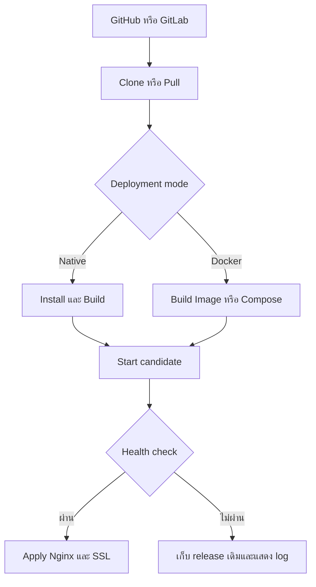

# Modern Host Manager

> Production status: the direct installer is deliberately TLS-only. Follow [the production acceptance runbook](docs/production-install.md) on a Ubuntu 24.04 or 25.04 amd64 host before installing it on a real host. Docker remains a development/integration environment, not a production certification.

> แผงควบคุมเซิร์ฟเวอร์แบบโอเพนซอร์สสำหรับนักพัฒนาที่ดูแลเครื่องด้วยตัวเอง เน้นใช้งานง่าย ประหยัดทรัพยากร และไม่พยายามแทนที่ cPanel, DirectAdmin หรือ Plesk ทุกฟีเจอร์

โปรเจกต์นี้มีเป้าหมายเพื่อรวมงานที่ต้องทำบ่อยบน Linux ไว้ใน Dashboard เดียว เช่น เชื่อม Git, deploy แอป, ผูกโดเมน, สร้าง Nginx reverse proxy, ออก SSL, restart service และดู log

สถานะปัจจุบัน: **อยู่ระหว่างออกแบบและเริ่มพัฒนา**

## สถานะ implementation

มี v0.1 Server Foundation ที่รันได้แล้วใน Docker sandbox: single-owner login, dashboard, `doctor`, tool inventory, allowlisted installer workflow, audit log และ Git/project-sync configuration

Sandbox ตั้งใจไม่แก้ package หรือ service ของ Docker host จึงใช้ทดสอบ UI/API ได้อย่างปลอดภัย แต่ยังไม่ใช่การรับรอง privileged operations บน server จริง ดูรายละเอียดข้อจำกัดที่ [ADR 0005](docs/adr/0005-docker-is-a-sandbox-not-a-host-certification.md)

### เริ่ม Docker sandbox สำหรับ `demo.test`

1. คัดลอก `.env.example` เป็น `.env` แล้วกำหนด `HOSTMGR_ADMIN_PASSWORD` ให้ยาวและไม่ซ้ำ และสร้าง `HOSTMGR_SECRET_KEY` เพียงครั้งเดียวด้วย `openssl rand -base64 32` ห้ามเปลี่ยน key นี้หลังบันทึก credential หรือ `.env` project แล้ว เพราะจะถอดรหัสค่าที่บันทึกไว้ไม่ได้
2. ให้ `demo.test` ชี้มายัง Docker host นี้
3. รัน `docker compose up --build -d`
4. เปิด `http://demo.test` แล้วเข้าสู่ระบบด้วยรหัสผ่านที่ตั้งไว้

Compose publish port 80 และใช้ Ubuntu 24.04 ภายใน container หากมี service อื่นจับ port 80 อยู่ ต้องหยุด service นั้นหรือเปลี่ยน port ก่อน

### ติดตั้ง production โดยไม่ใช้ Docker

เมื่อพร้อมใช้งานบน Ubuntu 24.04 หรือ 25.04 ให้ใช้ installer ใน release directory:

```bash
sudo ./dashboard-portal.sh --domain=dpt.domain.com --email=admin@example.com
```

Software updates are intentionally not applied by the web UI. The UI can show a
signed release notification; the owner performs the verified update over SSH
with `sudo dashboard-portal update --channel=stable`. See
[`docs/production-install.md`](docs/production-install.md) for initial release
channel configuration and publishing instructions.

ดูรายละเอียดและข้อกำหนด DNS/HTTPS ที่ [Production installation](docs/production-install.md)

## เป้าหมายหลัก

- ใช้งานส่วนตัวบนเซิร์ฟเวอร์เครื่องเดียวเป็นหลัก
- รองรับหลายแอปและหลายโดเมนจาก Dashboard เดียว
- ใช้ทรัพยากรต่ำด้วยโหมด Native เป็นค่าเริ่มต้น
- ใช้ Docker เฉพาะโปรเจกต์ที่ต้องการ isolation หรือ runtime ต่างเวอร์ชัน
- เชื่อมต่อ GitHub และ GitLab เพื่อ deploy จาก repository
- ตรวจสอบและติดตั้งเครื่องมือที่จำเป็นผ่าน UI หรือ CLI
- เปิดให้ผู้ใช้ที่รู้ Linux เข้าแก้ config และจัดการระบบเองได้เมื่อจำเป็น

## Target Environment

Official test/release targets:

```text
Ubuntu Server 24.04 LTS amd64
Ubuntu Server 25.04 amd64 (operational exception; see ADR 0012)
```

ในช่วงแรกจะทดสอบเฉพาะ environment นี้เพื่อลดความซับซ้อน ยังไม่รับประกันการทำงานบน distribution หรือ Ubuntu รุ่นอื่น

> [!NOTE]
> เครื่องพัฒนาปัจจุบันอาจเป็น Ubuntu 25.04 ได้ แต่ไม่ใช่ platform ที่ระบบรองรับหรือใช้รับรอง release เพราะหมดระยะสนับสนุนแล้ว การทดสอบที่แตะ host ให้รันใน Ubuntu 24.04 environment ที่แยกออกมา; Docker เหมาะกับการทดสอบ integration ที่แยกได้ แต่ไม่ทดแทน VM สำหรับ systemd, reboot และ package installation ของ host จริง

## แนวคิดการ Deploy

ระบบใช้แนวทาง **Native-first, Docker-optional**

### Native Mode — ค่าเริ่มต้น

แอปรันบน host โดยตรงและควบคุมผ่าน `systemd` เหมาะกับเครื่องสเปกต่ำและโปรเจกต์ที่ใช้ runtime เวอร์ชันเดียวกัน

- Nginx ทำงานบน host
- Node.js, PHP หรือ runtime อื่นติดตั้งบน host
- แต่ละโปรเจกต์มี working directory, environment และ systemd service ของตัวเอง
- รองรับ build, start, stop, restart และดู log ผ่าน Dashboard

### Docker Mode — ทางเลือก

ใช้สำหรับโปรเจกต์ที่ต้องการ dependency แยกจาก host, ใช้ runtime คนละเวอร์ชัน หรือมี `Dockerfile` / Compose อยู่แล้ว

- รองรับ Dockerfile
- รองรับ `compose.yaml`, `compose.yml` และ `docker-compose.yml`
- จัดการ container, image, volume และ network ที่เป็นของโปรเจกต์
- Nginx บน host ทำ reverse proxy ไปยังพอร์ตของ container

| หัวข้อ | Native | Docker |
| --- | --- | --- |
| RAM/พื้นที่จัดเก็บ | ต่ำกว่า | สูงกว่าเล็กน้อย |
| เริ่มใช้งาน | ง่ายสำหรับผู้รู้ Linux | ต้องมี Dockerfile/Compose |
| แยก dependency | ระดับ process/user | ระดับ container |
| หลาย runtime version | ไม่เน้นใน v1 | รองรับตาม image |
| เหมาะกับ | แอปส่วนตัวทั่วไป | แอปพิเศษหรือ dependency ซับซ้อน |

## ฟีเจอร์ในขอบเขต v1

### Dashboard

- ดู CPU, RAM, disk และ load average
- ดูสถานะ Nginx, Certbot, Git, Docker และ runtime
- ดูโปรเจกต์ โดเมน และ deployment ล่าสุด
- แสดงคำเตือนเมื่อ service หยุดหรือ dependency หาย

### Project Management

- สร้างโปรเจกต์แบบ Native หรือ Docker
- กำหนด repository, branch, build command, start command และ port
- จัดการ environment variables โดยไม่แสดง secret เต็มค่าใน UI
- Deploy, redeploy, stop, restart และ rollback
- Health check หลัง deploy
- ดู build log และ runtime log

### GitHub / GitLab

- Clone repository ผ่าน HTTPS หรือ SSH deploy key
- เลือก branch ที่ใช้ deploy
- Pull และ deploy ด้วยตนเองจาก Dashboard
- รองรับ webhook สำหรับ auto deploy
- เก็บ credential แบบเข้ารหัสและไม่เขียน token ลงใน log

### Domain Management

- เพิ่ม แก้ไข และลบโดเมน
- ผูกหนึ่งโดเมนหรือหลาย subdomain เข้ากับโปรเจกต์
- ตรวจสอบว่า DNS ชี้มายัง server หรือยัง
- Generate และ validate Nginx config ก่อนใช้งาน
- Reload Nginx เฉพาะเมื่อ config ผ่านการตรวจสอบ
- ตรวจหา config drift ระหว่างฐานข้อมูลของระบบกับไฟล์จริง
- Sync จาก Dashboard ไปยัง Nginx หรือ import config ที่ระบบรองรับกลับเข้า Dashboard

ใน v1 คำว่า **Domain Sync** หมายถึงการซิงก์ความสัมพันธ์ระหว่าง Project, Domain, Nginx และ SSL ภายในเซิร์ฟเวอร์ ไม่รวมการเป็น DNS server หรือแก้ DNS record บน Cloudflare/ผู้ให้บริการ registrar โดยตรง

### SSL

- ขอใบรับรอง Let's Encrypt ผ่าน Certbot
- เปิดใช้งาน HTTPS ให้โดเมนอัตโนมัติ
- ดูวันหมดอายุและสถานะ renewal
- ทดสอบ renewal จาก Dashboard หรือ CLI
- ไม่ออก certificate หาก DNS หรือ HTTP challenge ยังไม่พร้อม

### Nginx

- สร้าง reverse proxy config จาก template
- Preview diff ก่อน apply
- ตรวจสอบด้วย `nginx -t` ทุกครั้ง
- สำรอง config เดิมก่อนแก้ไข
- Restore config เดิมอัตโนมัติเมื่อ validation หรือ reload ล้มเหลว
- มี Advanced Mode สำหรับ custom directives โดยแยกออกจากส่วนที่ระบบ generate

### Logs และ Terminal

- ดู deployment log
- ดู systemd journal หรือ container log ของแต่ละโปรเจกต์
- ค้นหาและกรอง log ตามช่วงเวลา
- Terminal เป็น optional escape hatch และปิดไว้เป็นค่าเริ่มต้น

## System Tools และ Dependency Installer

เมื่อติดตั้ง Dashboard ระบบจะทำ preflight check และแสดงสถานะของเครื่องมือแต่ละรายการ

| Tool | ความจำเป็น | หน้าที่ |
| --- | --- | --- |
| Nginx | Required | Reverse proxy และรับ traffic จาก domain |
| Certbot | Required สำหรับ SSL | ออกและต่ออายุ Let's Encrypt certificate |
| Git | Required สำหรับ Git deploy | Clone และ pull source code |
| systemd | Required สำหรับ Native mode | ควบคุม process ของแอป |
| Docker Engine + Compose | Optional | ใช้งาน Docker mode |
| Node.js / PHP | Optional | ติดตั้งเฉพาะ runtime ที่ Native project ต้องใช้ |

สถานะที่ UI และ CLI ต้องรายงาน:

- `Installed` — พบเครื่องมือและเวอร์ชันรองรับ
- `Missing` — ยังไม่ได้ติดตั้งและสามารถติดตั้งได้
- `Unsupported` — พบเครื่องมือแต่เวอร์ชันไม่รองรับ
- `Misconfigured` — ติดตั้งแล้วแต่ config หรือ permission ไม่พร้อม
- `Healthy` / `Stopped` — สถานะ service ที่เกี่ยวข้อง

### ติดตั้งผ่าน UI

หน้า **Settings → System Tools** ต้องมีความสามารถดังนี้:

1. Scan เครื่องมือที่มีอยู่ในเครื่อง
2. แสดง package และคำสั่งที่จะถูกเรียกก่อนติดตั้ง
3. ให้ผู้ใช้กด **Install** เป็นรายเครื่องมือ
4. แสดง progress และ log ที่ตัดข้อมูลลับออกแล้ว
5. ตรวจสอบ version, config และ service หลังติดตั้ง
6. ไม่แก้ config เดิมโดยไม่แสดง diff หรือสร้าง backup

ตัวอย่าง:

```text
Nginx     Missing       [Install]
Certbot   Missing       [Install]
Git       Installed     2.x
Docker    Not installed [Install optional]
```

### ติดตั้งหรือบังคับตรวจสอบผ่าน CLI

ชื่อคำสั่งด้านล่างเป็น interface ที่วางแผนไว้และอาจเปลี่ยนก่อน release แรก:

```bash
# ตรวจสอบ requirement ทั้งหมด
hostmgr doctor

# ติดตั้งเฉพาะ required tools ที่ยังขาด
sudo hostmgr tools install --required

# ติดตั้งเครื่องมือที่ระบุ
sudo hostmgr tools install nginx certbot git

# ติดตั้ง Docker ซึ่งเป็น optional tool
sudo hostmgr tools install docker

# บังคับติดตั้งใหม่หรือซ่อม package/config ที่ระบบจัดการ
sudo hostmgr tools install nginx --force

# ตรวจสอบอีกครั้งหลังติดตั้ง
hostmgr tools check
```

ทั้ง UI และ CLI ต้องเรียก installer service ชุดเดียวกัน เพื่อให้ validation, log, backup และผลลัพธ์ตรงกัน

## Deployment Flow



การ deploy ต้องไม่ตัด release ที่กำลังทำงานจนกว่า build และ health check ของ release ใหม่จะผ่าน หาก deploy ล้มเหลว ระบบต้องเก็บ release เดิมไว้และแสดงสาเหตุที่ตรวจพบ

## Proposed Architecture

```text
Web Dashboard / CLI
        │
        ▼
Management API
        │
        ├── Project Service
        ├── Deployment Service
        ├── Domain & SSL Service
        ├── Tool Installer
        └── Audit Log
                │
                ▼
        Privileged Helper
                │
        ┌───────┴────────┐
        ▼                ▼
 Native/systemd     Docker/Compose
        │                │
        └───────┬────────┘
                ▼
           Host Nginx
```

Dashboard/API ไม่ควรรันเป็น `root` งานที่ต้องใช้สิทธิ์สูงต้องส่งไปยัง privileged helper ซึ่งรับเฉพาะ operation ที่กำหนดไว้ล่วงหน้า ตรวจสอบ input และบันทึก audit log ห้ามนำค่าจาก UI ไปต่อเป็น shell command โดยตรง

## โครงสร้างข้อมูลหลัก

### Server

- hostname และ OS information
- IP addresses
- tool/service status
- resource metrics

### Project

- name และ slug
- deployment mode: `native` หรือ `docker`
- repository และ branch
- build/start configuration
- internal port และ health-check path
- environment variables
- release history

### Domain

- hostname
- project และ target port
- SSL status
- Nginx config state
- DNS validation state

### Deployment

- commit SHA
- status และ timestamps
- build/runtime logs
- health-check result
- active/rollback release

## Security Principles

- Dashboard/API ทำงานด้วย Linux user ที่ไม่มีสิทธิ์ root
- แยก privileged helper และใช้ allowlist ของ operation
- Validate domain, path, port, repository URL และ config ทุกครั้ง
- ห้ามเก็บ Git token, SSH private key หรือ environment secret แบบ plaintext
- Redact secret จาก log และ error response
- ใช้ CSRF protection, secure cookie, rate limiting และ session timeout
- บันทึก audit log สำหรับ install, deploy, config change และ privileged action
- สำรองไฟล์ก่อนแก้ไขและใช้ atomic write เมื่อทำได้
- Terminal และ custom Nginx config เป็นฟีเจอร์ความเสี่ยงสูง ต้องเปิดใช้งานโดยเจ้าของเครื่อง
- UI installer ต้องแสดงสิ่งที่จะเปลี่ยนก่อนขอสิทธิ์ และต้องไม่รันคำสั่งจาก input อิสระ

## Non-goals สำหรับ v1

- Mail server
- DNS server
- FTP server
- Shared hosting และ multi-tenant isolation
- Reseller, license และ billing
- รองรับ PHP/Node หลายเวอร์ชันบน host ผ่าน Dashboard
- Kubernetes หรือ multi-server cluster
- File manager แบบเต็มรูปแบบ
- จัดการ DNS provider หรือ registrar อัตโนมัติ
- รองรับทุก Linux distribution

การตัดสิ่งเหล่านี้ออกช่วยให้ v1 เหมาะกับการใช้งานคนเดียวและทำงานได้ดีบนเครื่องสเปกต่ำ

## Roadmap

### v0.1 — Server Foundation

- Login สำหรับเจ้าของเครื่องหนึ่งคน
- Dashboard และ system metrics
- Tool detection และ `hostmgr doctor`
- Installer สำหรับ Nginx, Certbot และ Git ผ่าน CLI/UI
- Audit log

### v0.2 — Native Projects

- Git clone/pull
- Native build และ systemd service
- Environment variables
- Logs และ health check
- Manual deploy และ rollback

### v0.3 — Domains & SSL

- Domain inventory
- Nginx template, validation, diff และ rollback
- Certbot issue/renew
- Domain-to-project sync และ drift detection

### v0.4 — Docker Projects

- Docker/Compose installer
- Dockerfile และ Compose deployment
- Container logs, volumes และ networks ระดับโปรเจกต์

### v0.5 — Automation

- GitHub/GitLab webhook
- Auto deploy
- Backup/restore รายโปรเจกต์
- Notifications เมื่อ deploy หรือ renewal ล้มเหลว

## เกณฑ์ว่า v1 ใช้งานได้จริง

- ติดตั้งบน Ubuntu target ที่สะอาดได้จาก CLI โดยไม่ต้องแก้ไฟล์ด้วยมือ
- หาก Nginx, Certbot หรือ Git ไม่มีอยู่ ผู้ใช้ติดตั้งผ่าน UI ได้
- เพิ่ม Native project จาก Git และเปิดผ่านโดเมน HTTPS ได้
- เพิ่ม Docker project และใช้ Nginx ตัวเดียวกับ Native project ได้
- config ที่ผิดไม่ทำให้ Nginx ของทั้งเครื่องหยุดทำงาน
- deploy ที่ build หรือ health check ไม่ผ่านไม่ทำลาย release เดิม
- restart เครื่องแล้ว Dashboard, Nginx และแอปที่เปิดใช้งานกลับมาทำงานได้
- secret ไม่ปรากฏใน UI response, process arguments หรือ log

## การมีส่วนร่วม

โปรเจกต์ยังอยู่ในช่วงกำหนด architecture และ MVP หากต้องการช่วยพัฒนา สามารถเริ่มจาก issue ที่เกี่ยวกับ tool detection, Nginx config generation, systemd service management, Git deployment หรือ security review

ก่อนส่ง pull request ควรแนบ:

- คำอธิบายปัญหาและแนวทางแก้
- วิธีทดสอบบน target environment
- ผลกระทบต่อ permission และ security
- migration หรือ rollback plan หากมีการเปลี่ยน config/data

## License

ยังไม่ได้เลือก license ก่อนเปิด repository สู่สาธารณะควรเพิ่ม OSI-approved license เช่น Apache-2.0 หรือ AGPL-3.0 ตามเป้าหมายของโครงการ

---

เอกสารนี้เป็น product/technical scope เริ่มต้น รายละเอียดของ stack, package source, CLI flags และ API อาจเปลี่ยนระหว่างการพัฒนา
