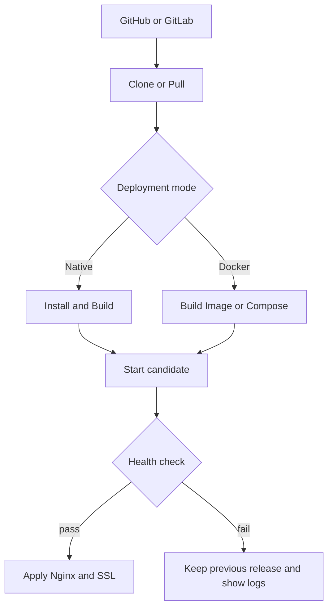

# Modern Host Manager

> Production status: the direct installer is deliberately TLS-only. Follow [the production acceptance runbook](docs/production-install.md) on a Ubuntu 24.04 or 25.04 amd64 host before installing it on a real host. Docker remains a development/integration environment, not a production certification.

> An open-source server control panel for developers who manage their own machines. It prioritizes ease of use and low resource use, and does not try to replace every feature of cPanel, DirectAdmin, or Plesk.

This project aims to bring common Linux host tasks into one Dashboard: connect Git, deploy apps, bind domains, create Nginx reverse proxies, issue SSL, restart services, and view logs.

Current status: **in design and early development**

## Implementation status

v0.1 Server Foundation already runs in the Docker sandbox: single-owner login, dashboard, `doctor`, tool inventory, allowlisted installer workflow, audit log, and Git/project-sync configuration.

The sandbox intentionally does not change packages or services on the Docker host, so UI/API testing is safe. It is not a certification of privileged operations on a real server. See the limits in [ADR 0005](docs/adr/0005-docker-is-a-sandbox-not-a-host-certification.md).

### Start the Docker sandbox for `demo.test`

1. Copy `.env.example` to `.env`, set a long unique `HOSTMGR_ADMIN_PASSWORD`, and create `HOSTMGR_SECRET_KEY` once with `openssl rand -base64 32`. Do not change this key after credentials or project `.env` values have been saved, or previously stored values cannot be decrypted.
2. Point `demo.test` at this Docker host.
3. Run `docker compose up --build -d`.
4. Open `http://demo.test` and sign in with the password you set.

Compose publishes port 80 and uses Ubuntu 24.04 inside the container. If another service already binds port 80, stop that service or change the port first.

### Install production without Docker

When ready on Ubuntu 24.04 or 25.04, use the installer in the release directory:

```bash
sudo ./dashboard-portal.sh --domain=dpt.domain.com --email=admin@example.com
```

Software updates are intentionally not applied by the web UI. The UI can show a
signed release notification; the owner performs the verified update over SSH
with `sudo dashboard-portal update --channel=stable`. See
[`docs/production-install.md`](docs/production-install.md) for initial release
channel configuration and publishing instructions.

For the repeatable Git, signed-release, and future-AI handoff process, see
[`docs/releasing-and-ai-handoff.md`](docs/releasing-and-ai-handoff.md).

See details and DNS/HTTPS requirements in [Production installation](docs/production-install.md).

## Main goals

- Personal use on a single server as the primary case
- Support multiple apps and domains from one Dashboard
- Keep resource use low with Native mode as the default
- Use Docker only for projects that need isolation or different runtime versions
- Connect GitHub and GitLab to deploy from repositories
- Detect and install required tools through the UI or CLI
- Let Linux-fluent users edit config and manage the system when needed

## Target Environment

Official test/release targets:

```text
Ubuntu Server 24.04 LTS amd64
Ubuntu Server 25.04 amd64 (operational exception; see ADR 0012)
```

Early testing focuses on this environment to reduce complexity. Other distributions or Ubuntu versions are not guaranteed.

> [!NOTE]
> A development machine may run Ubuntu 25.04, but that is not the supported or release-certification platform because it is past end of support. Host-touching tests should run in a separate Ubuntu 24.04 environment; Docker is good for isolated integration tests but does not replace a VM for systemd, reboot, and real-host package installation.

## Deploy model

The system follows **Native-first, Docker-optional**.

### Native Mode — default

Apps run directly on the host and are controlled through `systemd`. Best for low-spec machines and projects that share the same runtime version.

- Nginx runs on the host
- Node.js, PHP, or other runtimes are installed on the host
- Each project has its own working directory, environment, and systemd service
- Build, start, stop, restart, and logs are available through the Dashboard

### Docker Mode — optional

Use for projects that need dependencies isolated from the host, different runtime versions, or an existing `Dockerfile` / Compose setup.

- Supports Dockerfile
- Supports `compose.yaml`, `compose.yml`, and `docker-compose.yml`
- Manages project-owned containers, images, volumes, and networks
- Host Nginx reverse-proxies to the container port

| Topic | Native | Docker |
| --- | --- | --- |
| RAM / disk | Lower | Slightly higher |
| Getting started | Easy for Linux-fluent users | Needs Dockerfile/Compose |
| Dependency isolation | Process/user level | Container level |
| Multiple runtime versions | Not a v1 focus | Supported via images |
| Best for | Typical personal apps | Special apps or complex dependencies |

## Features in v1 scope

### Dashboard

- View CPU, RAM, disk, and load average
- View Nginx, Certbot, Git, Docker, and runtime status
- View projects, domains, and recent deployments
- Warn when a service is stopped or a dependency is missing

### Project Management

- Create Native or Docker projects
- Set repository, branch, build command, start command, and port
- Manage environment variables without showing full secret values in the UI
- Deploy, redeploy, stop, restart, and rollback
- Health check after deploy
- View build and runtime logs

### GitHub / GitLab

- Clone repositories over HTTPS or SSH deploy keys
- Choose the deploy branch
- Pull and deploy manually from the Dashboard
- Support webhooks for auto deploy
- Store credentials encrypted and never write tokens to logs

### Domain Management

- Add, edit, and delete domains
- Bind one domain or multiple subdomains to a project
- Check whether DNS points at the server
- Generate and validate Nginx config before use
- Reload Nginx only after config validation passes
- Detect config drift between system state and real files
- Sync from Dashboard to Nginx, or import supported config back into the Dashboard

In v1, **Domain Sync** means syncing Project, Domain, Nginx, and SSL relationships on the server. It does not include acting as a DNS server or editing DNS records on Cloudflare/a registrar directly.

### SSL

- Request Let's Encrypt certificates through Certbot
- Enable HTTPS for domains automatically
- View expiry dates and renewal status
- Test renewal from the Dashboard or CLI
- Do not issue a certificate if DNS or the HTTP challenge is not ready

### Nginx

- Generate reverse proxy config from templates
- Preview diffs before apply
- Always validate with `nginx -t`
- Back up existing config before changes
- Automatically restore previous config when validation or reload fails
- Provide Advanced Mode for custom directives, separate from generated sections

### Logs and Terminal

- View deployment logs
- View systemd journal or container logs per project
- Search and filter logs by time range
- Terminal is an optional escape hatch and is disabled by default

## System Tools and Dependency Installer

When the Dashboard is installed, the system runs a preflight check and shows the status of each tool.

| Tool | Necessity | Role |
| --- | --- | --- |
| Nginx | Required | Reverse proxy and receives domain traffic |
| Certbot | Required for SSL | Issue and renew Let's Encrypt certificates |
| Git | Required for Git deploy | Clone and pull source code |
| systemd | Required for Native mode | Control application processes |
| Docker Engine + Compose | Optional | Run Docker mode |
| Node.js / PHP | Optional | Install only runtimes Native projects need |

Statuses the UI and CLI must report:

- `Installed` — tool found at a supported version
- `Missing` — not installed and can be installed
- `Unsupported` — tool found but version is unsupported
- `Misconfigured` — installed but config or permissions are not ready
- `Healthy` / `Stopped` — related service status

### Install through the UI

**Settings → System Tools** must support:

1. Scan tools present on the machine
2. Show the packages and commands that will run before install
3. Let the user click **Install** per tool
4. Show progress and redacted logs
5. Verify version, config, and service after install
6. Never change existing config without showing a diff or creating a backup

Example:

```text
Nginx     Missing       [Install]
Certbot   Missing       [Install]
Git       Installed     2.x
Docker    Not installed [Install optional]
```

### Install or force-check through the CLI

The commands below are a planned interface and may change before the first release:

```bash
# Check all requirements
hostmgr doctor

# Install only missing required tools
sudo hostmgr tools install --required

# Install specific tools
sudo hostmgr tools install nginx certbot git

# Install Docker as an optional tool
sudo hostmgr tools install docker

# Force reinstall or repair managed packages/config
sudo hostmgr tools install nginx --force

# Re-check after install
hostmgr tools check
```

Both UI and CLI must call the same installer service so validation, logs, backups, and results stay consistent.

## Deployment Flow

Deploy requests are queued durably in the local SQLite control-plane database.
The browser receives an immediate job id and follows phase events; one worker
builds at a time so a small host is not overloaded and reverse-proxy timeouts
do not cancel a build.



Deploy must not cut over from the running release until the new release's build and health check pass. If deploy fails, the previous release must remain and the detected cause must be shown.

## Proposed Architecture

```text
Web Dashboard / CLI
        │
        ▼
Management API
        │
        ├── Project Service
        ├── Deployment Service
        ├── Domain & SSL Service
        ├── Tool Installer
        └── Audit Log
                │
                ▼
        Privileged Helper
                │
        ┌───────┴────────┐
        ▼                ▼
 Native/systemd     Docker/Compose
        │                │
        └───────┬────────┘
                ▼
           Host Nginx
```

Dashboard/API should not run as `root`. Privileged work must go to a privileged helper that accepts only predefined operations, validates input, and writes audit logs. Never concatenate UI values into shell commands.

## Core data model

### Server

- hostname and OS information
- IP addresses
- tool/service status
- resource metrics

### Project

- name and slug
- deployment mode: `native` or `docker`
- repository and branch
- build/start configuration
- internal port and health-check path
- environment variables
- release history

### Domain

- hostname
- project and target port
- SSL status
- Nginx config state
- DNS validation state

### Deployment

- commit SHA
- status and timestamps
- build/runtime logs
- health-check result
- active/rollback release

## Security Principles

- Dashboard/API runs as a non-root Linux user
- Separate privileged helper with an operation allowlist
- Validate domain, path, port, repository URL, and config every time
- Never store Git tokens, SSH private keys, or environment secrets in plaintext
- Redact secrets from logs and error responses
- Use CSRF protection, secure cookies, rate limiting, and session timeout
- Record audit logs for install, deploy, config changes, and privileged actions
- Back up files before edits and use atomic writes when possible
- Terminal and custom Nginx config are high-risk features and must be enabled by the machine owner
- The UI installer must show what will change before asking for permission and must not run free-form commands

## Non-goals for v1

- Mail server
- DNS server
- FTP server
- Shared hosting and multi-tenant isolation
- Reseller, license, and billing
- Managing multiple PHP/Node versions on the host through the Dashboard
- Kubernetes or multi-server clusters
- Full file manager
- Automatic DNS provider or registrar management
- Supporting every Linux distribution

Cutting these keeps v1 suitable for single-owner use and low-spec machines.

## Roadmap

### v0.1 — Server Foundation

- Login for a single machine owner
- Dashboard and system metrics
- Tool detection and `hostmgr doctor`
- Installer for Nginx, Certbot, and Git via CLI/UI
- Audit log

### v0.2 — Native Projects

- Git clone/pull
- Native build and systemd service
- Environment variables
- Logs and health check
- Manual deploy and rollback

### v0.3 — Domains & SSL

- Domain inventory
- Nginx template, validation, diff, and rollback
- Certbot issue/renew
- Domain-to-project sync and drift detection

### v0.4 — Docker Projects

- Docker/Compose installer
- Dockerfile and Compose deployment
- Project-scoped container logs, volumes, and networks

### v0.5 — Automation

- GitHub/GitLab webhook
- Auto deploy
- Per-project backup/restore
- Notifications when deploy or renewal fails

## v1 readiness criteria

- Install on a clean Ubuntu target from the CLI without hand-editing files
- If Nginx, Certbot, or Git is missing, the user can install them from the UI
- Add a Native project from Git and serve it over an HTTPS domain
- Add a Docker project and share the same Nginx as Native projects
- Bad config does not take down the whole machine's Nginx
- A deploy that fails build or health check does not destroy the previous release
- After reboot, Dashboard, Nginx, and enabled apps come back up
- Secrets do not appear in UI responses, process arguments, or logs

## Contributing

The project is still defining architecture and MVP. Useful starting points include issues about tool detection, Nginx config generation, systemd service management, Git deployment, or security review.

Before opening a pull request, include:

- Problem description and proposed approach
- How to test on the target environment
- Impact on permissions and security
- Migration or rollback plan if config/data changes

## License

No license has been chosen yet. Before making the repository public, add an OSI-approved license such as Apache-2.0 or AGPL-3.0 based on project goals.

---

This document is an initial product/technical scope. Stack details, package sources, CLI flags, and APIs may change during development.
