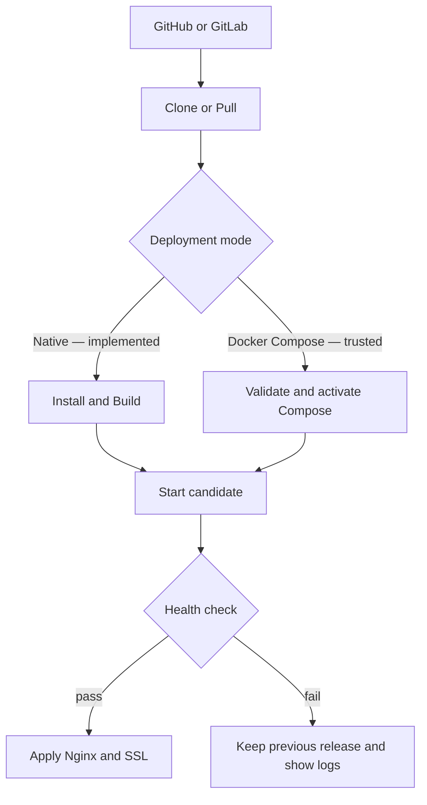

# Product scope, architecture reference, and roadmap

This document is the design/spec reference moved out of the root `README.md`
so that file can stay focused on installing and using Dashboard Portal. It
records what v1 is trying to be, which listed capability is actually working
in the current code versus still planned, and the longer-term roadmap.

Status labels used below:

- **Implemented** — exercised by the test suite and reachable from the UI/CLI today.
- **Partial** — some of the described capability exists; the rest is listed explicitly.
- **Planned** — described for context; not present in the code yet.

## Main goals

- Personal use on a single server as the primary case
- Support multiple apps and domains from one Dashboard
- Keep resource use low with Native mode as the default
- Use Docker only for projects that need isolation or different runtime versions
- Connect GitHub and GitLab to deploy from repositories
- Detect and install required tools through the UI or CLI
- Let Linux-fluent users edit config and manage the system when needed

## Target environment

```text
Ubuntu Server 24.04 LTS amd64
Ubuntu Server 25.04 amd64 (operational exception; see ADR 0012)
```

Early testing focuses on this environment to reduce complexity. Other
distributions or Ubuntu versions are not guaranteed. See
[ADR 0001](../adr/0001-ubuntu-24-04-is-the-supported-host.md) and
[ADR 0012](../adr/0012-ubuntu-25-04-is-an-operationally-supported-host.md).

## Deploy model

**Native-first, Docker-optional.**

**Native Mode (Implemented)** — apps run directly on the host under `systemd`.
Each project gets its own service account, release directory, environment
file, and systemd unit created by the root-owned helper
(`scripts/hostmgr-deploy-helper.mjs`).

**Docker Compose Mode (Implemented, v0.5)** — trusted repositories choose a
repository-relative Compose YAML file and web service. The root helper performs
policy validation, controlled build/start, host health check, rollback, and
container-log access. It rejects privileged containers, host namespaces, and
host bind mounts; this is a guardrail, not a hostile-code sandbox (ADR 0021).

| Topic | Native | Docker |
| --- | --- | --- |
| RAM / disk | Lower | Slightly higher |
| Getting started | Easy for Linux-fluent users | Needs Dockerfile/Compose |
| Dependency isolation | Process/user level | Container level |
| Multiple runtime versions | Not a v1 focus | Supported via images |
| Best for | Typical personal apps | Special apps or complex dependencies |
| Current status | **Implemented** | **Implemented (trusted Docker Compose, v0.5)** |

## Features in v1 scope

### Dashboard

- View host name, platform, Node major, and uptime — **Implemented**
- View total memory — **Implemented**
- View CPU load average and disk usage — **Implemented** (live snapshot + 5-minute history retained 30 days; UI ranges 1/3/7/15/30)
- Owner email/password bootstrap and login — **Implemented**
- Optional database client connectors (MongoDB/PostgreSQL/MySQL/Redis) — **Implemented** (metadata + encrypted secret + TCP probe; not host DB packages)
- View Nginx, Certbot, Git, Docker, and runtime status — **Implemented** (`doctorReport`, live-probed in host mode)
- View projects, domains, and recent deployments — **Implemented**
- Warn when a required tool is missing — **Implemented** (readiness checklist on the overview page)

### Project management

- Create Native projects: repository, branch, directory, build/start command, port — **Implemented**
- Docker Compose projects — **Implemented (v0.5)** for trusted repositories: selected Compose file/service, policy preflight, guarded host activation, rollback, and container logs
- Manage environment variables without exposing full values in the UI — **Implemented** (encrypted at rest, API returns key names only)
- Deploy and rollback — **Implemented**, including a durable job queue that survives a Dashboard restart
- Stop/restart as a standalone action (outside of deploy/rollback) — **Planned**
- Health check after deploy — **Implemented** (candidate check + host check, optional per project)
- View build/candidate logs — **Implemented** (per-release event log in the Logs dialog)
- View live runtime/systemd logs from the UI — **Implemented** (`/projects/:slug/logs`, auto-refreshing; reads the project's systemd unit through the root-owned helper, see [ADR 0019](../adr/0019-runtime-project-logs-are-read-through-the-root-owned-helper.md))

### GitHub / GitLab

- Clone over HTTPS with a stored token credential — **Implemented**
- Clone over SSH deploy keys — **Planned**; SSH projects are intentionally blocked (`needs_ssh_key`) until key generation, registration, rotation, and revocation exist
- Choose the deploy branch (fetched from the remote) — **Implemented**
- Manual deploy from the Dashboard — **Implemented**
- Webhook-triggered auto deploy — **Planned (v0.6)**
- Store credentials encrypted, never returned or logged — **Implemented**

### Domain management

- Add/remove domains bound to a project (up to 10; removing the final domain removes only Portal-managed Nginx/TLS) — **Implemented**
- DNS check (A/AAAA against this host) before and after saving — **Implemented**
- Generate and validate Nginx config before use — **Implemented** (`nginx -t` before every reload)
- Preview a diff before applying a Nginx change — **Planned** (the helper snapshots/restores internally, but nothing is shown to the owner before sync)
- Detect config drift between system state and managed files — **Partial**: `checkDrift()` exists in `src/nginx.mjs` as a primitive; there is no scheduled check or dashboard alert wired to it yet
- Sync from Dashboard to Nginx — **Implemented**
- Import existing external Nginx config back into the Dashboard — **Planned**

### SSL

- Request Let's Encrypt certificates through Certbot — **Implemented**
- Enable HTTPS automatically after issuance — **Implemented**
- View expiry dates and renewal status in the UI — **Planned**
- Trigger/test renewal from the Dashboard or a CLI — **Planned** (renewal today depends on Certbot's own system timer, outside the app)
- Refuse to issue a certificate until DNS resolves — **Implemented** (`getent ahosts` check before calling Certbot)

### Nginx

- Generate reverse-proxy config from templates — **Implemented**
- Preview diffs before apply — **Planned**
- Always validate with `nginx -t` — **Implemented**
- Back up existing config before changes — **Implemented**
- Automatically restore previous config on validation/reload failure — **Implemented**
- Advanced Mode for custom directives — **Planned**

### Logs and terminal

- Per-release deployment/build logs in the UI — **Implemented**
- systemd journal logs per Native project and Compose logs per Docker project, from the UI — **Implemented** (see `/projects/:slug/logs` above)
- Search/filter logs by time range — **Planned** (Activity page is an unfiltered table today; the runtime log viewer shows a fixed recent-lines window)
- In-browser terminal escape hatch — **Planned**; no such feature exists in the code yet, so there is nothing to gate behind an owner opt-in

## System tools and dependency installer

The **Settings → System Tools** UI flow described below is **Implemented**:
scan tools, show what an install will do, require explicit confirmation,
install through the allowlisted helper (simulated in `demo` mode, real `apt`
install in `host` mode), and refresh status after.

| Tool | Necessity | Role |
| --- | --- | --- |
| Nginx | Required | Reverse proxy and receives domain traffic |
| Certbot | Required for SSL | Issue and renew Let's Encrypt certificates |
| Git | Required for Git deploy | Clone and pull source code |
| systemd | Required for Native mode | Control application processes |
| Docker Engine + Compose | Optional | Run Docker mode |
| Node.js / PHP | Optional | Install only runtimes Native projects need |

The CLI shown below is a **planned interface only** — there is no `hostmgr`
binary in this repository today. The only real command-line entry points are
`dashboard-portal.sh` (installer) and the `dashboard-portal` command it
provisions on the host (`update`, `configure-update`, `--reset-pwd`). Treat
the block below as a design placeholder, not a usable command:

```bash
# Planned, not implemented yet
hostmgr doctor
sudo hostmgr tools install --required
sudo hostmgr tools install nginx certbot git
sudo hostmgr tools install docker
sudo hostmgr tools install nginx --force
hostmgr tools check
```

## Deployment flow



Deploy does not cut over from the running release until the new release's
build and health check pass. If deploy fails, the previous release remains
active and the detected cause is shown in the release log
(see [deployment-diagnostics-and-health-checks.md](deployment-diagnostics-and-health-checks.md)).

## Proposed architecture

```text
Web Dashboard / CLI
        │
        ▼
Management API
        │
        ├── Project Service
        ├── Deployment Service
        ├── Domain & SSL Service
        ├── Tool Installer
        └── Audit Log
                │
                ▼
        Privileged Helper
                │
        ┌───────┴────────┐
        ▼                ▼
 Native/systemd     Docker/Compose
        │                │
        └───────┬────────┘
                ▼
           Host Nginx
```

Everything above the Privileged Helper is **Implemented** and matches
`src/server.mjs` / `src/helper-client.mjs`. The Privileged Helper and
Native/systemd and trusted Docker/Compose paths are **Implemented** in
`scripts/hostmgr-deploy-helper.mjs`; Docker guardrails are defined in ADR 0021.
For the authoritative, currently-accurate trust-boundary description, see
[architecture.md](architecture.md); this diagram is kept here only because it
reads well next to the roadmap below.

## Core data model

### Server
- hostname and OS information
- IP addresses
- tool/service status
- resource metrics

### Project
- name and slug
- deployment mode: `native` or `docker` (only `native` exists today)
- repository and branch
- build/start configuration
- internal port and health-check path
- environment variables
- release history

### Domain
- hostname
- project and target port
- SSL status
- Nginx config state
- DNS validation state

### Deployment
- commit SHA
- status and timestamps
- build/runtime logs
- health-check result
- active/rollback release

## Security principles

These are design tenets; for the enforced trust boundary see
[architecture.md](architecture.md), and for the decisions behind each
boundary see [docs/adr/](../adr/).

- Dashboard/API runs as a non-root Linux user
- Separate privileged helper with an operation allowlist
- Validate domain, path, port, repository URL, and config every time
- Never store Git tokens, SSH private keys, or environment secrets in plaintext
- Redact secrets from logs and error responses
- Use CSRF protection, secure cookies, rate limiting, and session timeout
- Record audit logs for install, deploy, config changes, and privileged actions
- Back up files before edits and use atomic writes when possible
- Terminal and custom Nginx config are high-risk features and must be enabled by the machine owner (not yet applicable: neither feature exists yet)
- The UI installer must show what will change before asking for permission and must not run free-form commands

## Non-goals for v1

- Mail server
- DNS server
- FTP server
- Shared hosting and multi-tenant isolation
- Reseller, license, and billing
- Managing multiple PHP/Node versions on the host through the Dashboard
- Kubernetes or multi-server clusters
- Full file manager
- Automatic DNS provider or registrar management
- Supporting every Linux distribution

Cutting these keeps v1 suitable for single-owner use and low-spec machines.

## Roadmap

### v0.1 — Server Foundation — done

Login for a single machine owner, dashboard and system metrics, tool
detection, installer for Nginx/Certbot/Git via UI, audit log.

### v0.2 — Native Projects — mostly done

Git clone/pull, native build (`npm ci` + optional build script) and systemd
service, environment variables, build/candidate logs and health check, manual
deploy and rollback with a durable job queue. Remaining gaps: SSH deploy keys,
and moving repository clone/build out of the dashboard service account into
the privileged helper's isolation boundary.

### v0.3 — Domains & SSL — mostly done

Domain inventory, Nginx template rendering with mandatory `nginx -t`
validation and automatic rollback on failure, Certbot issue on activation.
Remaining gaps: no diff preview before apply, no UI-facing drift detection or
alerting, no certificate expiry/renewal view.

### v0.4 — Admin UI rewrite, runtime logs, and database connectors — done

Server-rendered multi-page admin UI replacing the original single-page shell
(see [ui-rewrite-layout.md](ui-rewrite-layout.md)), owner password management,
database client connectors (MongoDB/PostgreSQL/MySQL/Redis), and the
per-project runtime log viewer ([ADR 0019](../adr/0019-runtime-project-logs-are-read-through-the-root-owned-helper.md)).

### v0.5 — Operations UX + Docker Compose — done

Animated deployment phases and busy controls, complete management deletion,
Monitor Logs Tokens, encrypted provider-aware deployment notifications, domain
status/recheck guidance, and trusted Docker Compose projects. Docker activation
is host-validated and supports rollback; it is not a general container-security
boundary (see ADR 0021).

### v0.6 — Automation — not started

No GitHub/GitLab inbound auto-deploy, no per-project backup/restore, no
certificate-expiry alert, and no notification retry queue.

## v1 readiness criteria

- Install on a clean Ubuntu target from the CLI without hand-editing files
- If Nginx, Certbot, or Git is missing, the user can install them from the UI
- Add a Native project from Git and serve it over an HTTPS domain
- Add a Docker project and share the same Nginx as Native projects
- Bad config does not take down the whole machine's Nginx
- A deploy that fails build or health check does not destroy the previous release
- After reboot, Dashboard, Nginx, and enabled apps come back up
- Secrets do not appear in UI responses, process arguments, or logs
