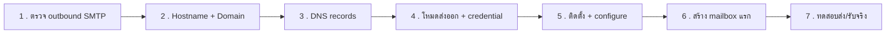

# Mail Setup Wizard — ออกแบบขั้นตอนติดตั้ง self-hosted Mail Service

Status: **Partially implemented in v0.6.0**. Portal now detects outbound SMTP
capability, reads supported local inbound firewall policy, and provisions only
the services whose ports are permitted. The full design remains the product
reference for later work; read [ADR 0025](../adr/0025-port-aware-mail-host-provisioning.md)
for the implemented safety boundary.

The remaining roadmap includes a real external inbound-mail probe, mailbox
backup/quota work, and DKIM rotation UX. Before Mail service is configured,
the Mail page shows a clearly labelled fixture inbox to orient the owner; once
configured it switches to service and mailbox management. A local host cannot
prove provider firewall or public Internet reachability by probing itself.

## เอกสารอ้างอิงที่ใช้ประกอบการออกแบบ

- `src/mail-check.mjs` — outbound SMTP probe (25/587/2525) พร้อม `recommendOutboundPlan()` ที่มีอยู่แล้ว
- `src/dns-check.mjs` — `checkDomainDns()` สำหรับ A/AAAA ของ project domain พร้อม Cloudflare-proxy detection ที่มีอยู่แล้ว
- `src/server.mjs` — `handleInstall()` (allowlisted tool install, `confirm:true`, demo vs host), `handleMailOutboundCheck()`, domain-check route
- `src/core.mjs` — `TOOLS` registry, `SecretVault` (AES-256-GCM), `appendAudit()`, `validateProjectDomains()` (cap 10 โดเมนต่อโปรเจค)
- `scripts/hostmgr-deploy-helper.mjs` — root-owned helper, `dispatch()` allowlist, certbot/Nginx pattern ใน `applyDomains()`/`issueCertificate()`
- `views/pages/mail.html` + `public/ui/app.js` (`MAIL_DEMO`, `renderMail`, `renderMailSetupNotice`) — ก่อนติดตั้งแสดง fixture inbox ที่ติดป้ายชัดเจน; เมื่อ `configure.status` เป็น `configured` จะซ่อน fixture และแสดงสถานะ/mailbox จริง
- `public/ui/app.js` (`renderDomainList`, `domainStatusChip`, `refreshDomainStatuses`) — pattern การ verify DNS ทีละ record ที่มีอยู่แล้วสำหรับ project domain, ใช้เป็นต้นแบบของ mail DNS record verify

---

## สรุปคำตอบ 3 ข้อของ owner (แบบสั้น อ่านจบในหน้าเดียว)

1. **ใช้โดเมนไหน/ยังไง** — แยกเป็น 2 ค่าเสมอ: **mail hostname** (เช่น `mail.example.com`
   — ใช้เป็น PTR/HELO/TLS cert ของตัว mail server เอง มีได้ **ค่าเดียว**ต่อ host) และ
   **mail domain** (เช่น `example.com`, `buildupclick.com` — ใช้เป็นส่วนหลัง `@` ของ
   mailbox มีได้**หลายโดเมน**). Portal ไม่ auto-pick ให้ทั้งหมด — เสนอ **mail domain**
   เป็นตัวเลือกจากโดเมนที่ผูกกับโปรเจคอยู่แล้ว (เลือกจาก checkbox) และเสนอ **mail
   hostname** เป็นค่าที่พิมพ์ล่วงหน้าไว้ (`mail.<root domain ของโปรเจคที่พบมากที่สุด>`)
   แต่ owner แก้ไขได้ทั้งคู่เสมอ ไม่มีการบังคับ
2. **เพิ่มโดเมนเองได้ไหม** — ได้ ทั้งช่วง wizard (step 2) และภายหลังจากหน้า Mail settings
   โดยไม่ต้องรื้อ wizard ใหม่ — พิมพ์โดเมนใหม่ที่ไม่เคยผูกกับโปรเจคใดก็ได้ (เช่น root
   domain ที่ไม่มีเว็บ มีไว้ใช้อีเมลอย่างเดียว) จำกัดสูงสุด **10 โดเมนต่อ host** (ใช้ cap
   เดียวกับ `validateProjectDomains` เพื่อความสอดคล้อง) ลบได้ภายหลังเช่นกัน (บล็อคถ้ายังมี
   mailbox ค้างอยู่ใต้โดเมนนั้น เว้นแต่ force)
3. **Wizard มีกี่ step** — 7 step (ดูรายละเอียดเต็มใน [ส่วนที่ 3](#3-wizard-steps)):
   1. ตรวจ outbound SMTP (ผูกของเดิมใน Setup เข้ามา ไม่ต้องสร้างใหม่)
   2. ตั้ง mail hostname + เลือก/เพิ่ม mail domain(s)
   3. แสดง DNS records (MX/SPF/DKIM/DMARC) ต่อโดเมน + verify ทีละรายการ
   4. เลือกโหมดส่งออก (direct/relay-587/relay-2525) ตามผลตรวจ + กรอก relay credential ถ้าจำเป็น
   5. ติดตั้ง + configure mail server ผ่าน helper (มี confirm, แสดง demo-mode ชัดเจน)
   6. สร้าง mailbox แรก
   7. ทดสอบส่งจริง (+ รับจริงใน Phase 2) พร้อมเกณฑ์ผ่าน/ตก

---

## 1. Domain model

### 1.1 Mail hostname ≠ Mail domain

| | Mail hostname | Mail domain |
| --- | --- | --- |
| ตัวอย่าง | `mail.example.com` | `example.com`, `ops.buildupclick.com` |
| ใช้ทำอะไร | PTR/rDNS target, SMTP HELO/EHLO greeting name, Common/Subject Name ของ TLS certificate สำหรับ STARTTLS (SMTP 587/25, IMAPS 993) | ส่วนหลัง `@` ของ mailbox address (`portal@example.com`); เจ้าของ MX/SPF/DKIM/DMARC record |
| จำนวนต่อ host | **1 ค่าเดียว** — Postfix/Dovecot มี server identity (`myhostname`) เดียวต่อ instance | **หลายค่าได้** (สูงสุด 10) — Postfix รองรับ virtual mail domains หลายโดเมนพร้อมกันโดยธรรมชาติ |
| เก็บใน state | `state.mail.hostname` (scalar) | `state.mail.domains[]` (array) |

นี่คือประเด็นสำคัญที่สุดของ domain model: **หนึ่ง host มี mail hostname เดียว แต่รับ/ส่ง
อีเมลของหลาย mail domain ผ่าน hostname เดียวกันได้** เหมือนที่ Nginx ตัวเดียวเสิร์ฟหลาย
project domain — mail hostname ไม่จำเป็นต้องเป็นหนึ่งใน mail domain เลยก็ได้ (เช่น
hostname = `mail.example.com` แต่ mail domain มีแค่ `buildupclick.com` — ใช้ได้ปกติ)

### 1.2 Portal เลือก default จากไหน

Portal **ไม่มี** ค่าที่เก็บ "โดเมนของ Portal เอง" ไว้ใน state (โดเมนตอนติดตั้ง
`dashboard-portal.sh --domain=` เป็นแค่ artifact ของ Nginx/Certbot ตอน install ไม่ได้
ถูก persist กลับเข้า SQLite state) ดังนั้น default ต้องมาจากสิ่งที่ query ได้จริงคือ
**โดเมนที่ผูกกับโปรเจคอยู่แล้ว** (`state.projects[*].domains.hosts`):

1. ดึง root domain (eTLD+1 แบบหยาบ — ตัด subdomain ซ้าย, เช่น `app.example.com` →
   `example.com`) จากโดเมนโปรเจคทั้งหมด นับความถี่
2. root domain ที่พบบ่อยที่สุด → เสนอเป็น **mail domain default** (checkbox เลือกไว้ล่วงหน้า)
   และเสนอ `mail.<root domain นั้น>` เป็น **mail hostname default** (prefill ในช่อง แต่แก้ได้)
3. ถ้ายังไม่มีโปรเจคเลย หรือไม่มีโดเมนผูกอยู่เลย → ไม่ prefill อะไร ให้ owner พิมพ์เอง
   ทั้งสองช่อง (mail hostname และ mail domain แรก)
4. owner แก้ไขทั้งสองค่าได้อิสระเสมอ — การ prefill เป็นแค่ shortcut ไม่ใช่ข้อจำกัด

### 1.3 เพิ่มโดเมนเองได้กี่โดเมน เพิ่ม/ลบภายหลังได้ไหม

- **เพิ่มเองได้เต็มที่** ไม่จำกัดว่าต้องเป็นโดเมนที่มีโปรเจคอยู่แล้ว — พิมพ์ FQDN ใหม่ที่ไม่
  เคยผูกกับอะไรใน Portal เลยก็ได้ (validate ด้วย `validateDomain()` เดิม)
- **Cap 10 โดเมนต่อ host** — ใช้ constant เดียวกับ `validateProjectDomains` (ไม่ใช่ข้อจำกัด
  ทางเทคนิคของ Postfix ซึ่งรองรับได้มากกว่านี้มาก แต่ 10 พอสำหรับ personal/small-team use
  และให้ UI/DKIM-key-management ไม่บวมเกินไป)
- **เพิ่มภายหลังได้** จากหน้า Mail settings (ไม่ต้องเข้า wizard ใหม่) — ใช้ endpoint เดียวกับที่
  wizard step 2/3 ใช้ (`POST /api/mail/domains`) เพราะ per-domain DNS record generation
  (DKIM key ใหม่ต่อโดเมน ฯลฯ) เหมือนกันทุกประการไม่ว่าจะเพิ่มตอนไหน
- **ลบได้ภายหลัง** — บล็อคถ้ายังมี mailbox ค้างอยู่ใต้โดเมนนั้น (ต้องลบ/ย้าย mailbox ก่อน หรือ
  ส่ง `force=true` ซึ่งจะลบ mailbox ที่เหลือทิ้งไปด้วย — เตือนชัดเจนก่อนอนุญาต) เหมือน
  pattern การลบโปรเจคที่บล็อคถ้ามี deployment job ค้างอยู่ (`handleProjectDelete`)

### 1.4 ความสัมพันธ์กับ TLS certificate (Certbot ที่มีอยู่แล้ว)

Mail hostname ต้องมี TLS certificate สำหรับ STARTTLS บนพอร์ต 25/587 และ IMAPS 993 —
ใช้ **certbot flow เดิม** ที่ helper มีอยู่แล้ว (`issueCertificate()` แบบ webroot HTTP-01,
`--non-interactive --agree-tos --keep-until-expiring --expand`) ไม่สร้างกลไกใหม่:

- ถ้า mail hostname เป็นโดเมนใหม่ที่ไม่เคยมี cert (เช่น `mail.example.com` แยกจาก
  โปรเจคทั้งหมด) → issue cert ใหม่ด้วยชื่อคงที่ `--cert-name hostmgr-mail` (แยก namespace
  จาก `hostmgr-<slug>` ของโปรเจค เพื่อไม่ชนกันใน `/etc/letsencrypt/live/`)
- ถ้า owner เลือกใช้โดเมนเดียวกับที่โปรเจคใช้อยู่แล้วเป็น mail hostname (เช่น
  `portal.example.com` ที่มี cert `hostmgr-<slug>` อยู่แล้ว) → **ไม่ออก cert ซ้ำ** ให้
  `--expand` cert เดิมของโปรเจคนั้นเพิ่ม mail hostname เข้าไปเป็น SAN แทน (ตรวจสอบก่อนว่า
  hostname อยู่ใน SAN ของ cert ที่มีอยู่แล้วหรือยัง)
- Renewal ใช้ systemd timer ของ Certbot เดิมที่ renew ทุก cert อัตโนมัติอยู่แล้ว —
  ไม่ต้องเพิ่ม renewal logic เฉพาะของ mail
- Mail service **ไม่ผ่าน Nginx** (Postfix/Dovecot bind พอร์ตของตัวเอง 25/587/993/995
  โดยตรง ไม่ใช่ reverse proxy 443) จึงไม่กระทบ virtual host ของโปรเจคใดๆ ที่มีอยู่ —
  ควรระบุให้ owner เข้าใจชัดจุดนี้ใน step 5 เพื่อลดความกังวลว่า "จะพังเว็บที่รันอยู่ไหม"

---

## 2. DNS records ต่อโดเมน

ทุก record ใช้สถานะ UI ชุดเดียวกัน (ต่อยอด vocabulary ที่ `renderDomainList`/
`domainStatusChip` ใช้กับ project domain อยู่แล้ว):

| สถานะภายใน | status-chip label | variant |
| --- | --- | --- |
| `pending` | ยังไม่ตรวจ | `muted` |
| `checking` | กำลังตรวจ | `muted` |
| `verified` | ตรวจผ่าน | `ready` |
| `mismatch` | ค่าไม่ตรง | `needs` |
| `not_found` | ไม่พบ record | `needs` |
| `error` | ตรวจไม่สำเร็จ | `needs` |

### 2.1 MX (ต่อ mail domain)

- **ค่าที่ generate ให้ copy**: `<mail domain>.  MX  10  <mail hostname>.`
- **Verify**: `dns.resolveMx(mailDomain)` — ต้องเจอ exchange ที่ตรงกับ mail hostname
  (case-insensitive, ตัด trailing dot) อย่างน้อย 1 รายการ หาก mail hostname อยู่หลัง
  Cloudflare proxy ระบบจะยอมรับ alias ที่ Cloudflare ตอบกลับในรูป
  `_dc-mx.<hash>.<mail hostname>` ด้วย; alias นี้อาจไม่ปรากฏเป็น record ใน DNS dashboard
  และระบบจะรับเฉพาะรูปแบบที่ลงท้ายด้วย hostname เดียวกันเท่านั้น
- **UI**: `verified` ถ้าเจอตรง, `mismatch` ถ้ามี MX แต่ชี้ไปที่อื่น, `not_found` ถ้าไม่มี MX เลย

### 2.2 SPF (TXT ที่ root ของ mail domain)

- **ค่าที่ generate ให้ copy** ขึ้นกับโหมดส่งออกที่เลือกใน step 4:
  - `direct`: `v=spf1 mx a:<mail hostname> ~all`
  - `relay-587` / `relay-2525`: `v=spf1 include:<relay provider> ~all` (Portal เสนอ preset
    ของ 3 provider เดียวกับที่ `mail-check.mjs` แนะนำอยู่แล้ว: SMTP2GO, Mailgun, SendGrid)
- **Verify**: `dns.resolveTxt(mailDomain)` → หา record ที่ขึ้นต้นด้วย `v=spf1`, เช็คว่ามี
  mechanism ที่คาดไว้ (`mx`/`a:host` หรือ `include:relay`) เป็น substring token, และ
  **เตือนถ้าพบ TXT ที่ขึ้นต้น `v=spf1` มากกว่า 1 record** (ผิด SPF spec, receiver มักมองว่า
  fail ทั้งชุด — เป็นข้อผิดพลาดที่ owner มักไม่รู้ตัว)
- **UI**: `verified` / `mismatch` (พบ SPF แต่ไม่มี mechanism ที่ต้องการ หรือมีมากกว่า 1
  record) / `not_found`

### 2.3 DKIM (TXT ที่ `<selector>._domainkey.<mail domain>`)

- Portal **generate keypair เอง** (RSA 2048 เป็น default — เข้ากันได้กว้างที่สุดกับ receiver
  ทุกเจ้า) พร้อม selector ที่ตั้งชื่อแบบ date-based เช่น `portal2026` (ช่วยตอน rotate คีย์
  ในอนาคต ไม่ต้องคิดชื่อใหม่ตอนนั้น)
- **Private key**: เขียนลงไฟล์บน host โดย helper (`/etc/opendkim/keys/<domain>/<selector>.private`,
  chmod `0600`, chown `opendkim`) — นี่คือสำเนาที่ MTA ใช้งานจริง; เก็บสำเนาเข้ารหัส (AES-256-GCM
  ผ่าน `SecretVault` เดิม) ไว้ใน state ด้วย **เพื่อกู้คืนเท่านั้น** (ดู decision ที่ต้องให้
  owner เคาะใน [ส่วนที่ 7](#7-การตัดสินใจสำคัญที่ต้องให้-owner-เคาะ)) — private key **ไม่**
  ส่งกลับ browser หลัง generate เสร็จ
- **Public key**: แสดงให้ copy เป็น `v=DKIM1; k=rsa; p=<base64 public key>`
- **Verify**: `dns.resolveTxt('<selector>._domainkey.<mailDomain>')` → parse ค่า `p=` แล้ว
  เทียบตรงกับ public key ที่ generate ไว้ (ไม่ใช่แค่เช็คว่ามี record — เทียบค่าจริงเพราะ
  Portal รู้ค่าที่ถูกต้องอยู่แล้ว)
- **UI**: `verified` (ตรงเป๊ะ) / `mismatch` (มี record แต่ `p=` ไม่ตรง) / `not_found`
- **Rotation** (ดู [ส่วนที่ 6](#6-edge-cases--risks)): state รองรับหลาย selector ต่อโดเมน
  (`active`/`retiring`) จาก day 1 ของ data model แม้ Phase 1 UI จะยังไม่มีปุ่ม rotate ก็ตาม

### 2.4 DMARC (TXT ที่ `_dmarc.<mail domain>`)

- **ค่าที่ generate ให้ copy**: `v=DMARC1; p=none; rua=mailto:postmaster@<mail domain>; fo=1`
  — เริ่มที่ `p=none` (monitor-only) ตาม DMARC rollout practice มาตรฐาน แล้วให้ owner ค่อย
  ขยับเป็น `quarantine`/`reject` เองภายหลังจากหน้า Mail settings (Phase 2+ ค่อยมี UI ปรับ policy)
- **Verify**: `dns.resolveTxt('_dmarc.<mailDomain>')` → ต้องขึ้นต้น `v=DMARC1` และมี `p=` tag
- **UI**: `verified` / `mismatch` / `not_found`

### 2.5 PTR / rDNS (ระดับ host ไม่ใช่ระดับโดเมน — แนะนำเท่านั้น)

PTR ผูกกับ **IP ของ host** ไม่ใช่ zone ของ mail domain ใดๆ — Portal **ตั้งให้ไม่ได้**
เพราะต้องตั้งที่ผู้ให้บริการ IP/VPS (DigitalOcean, Hetzner, AWS ฯลฯ) ไม่ใช่ DNS provider
ของโดเมน จึงเป็นสถานะ **advisory** เท่านั้น ไม่ block wizard:

- ใช้ `hostExpectedAddresses()` (มีอยู่แล้วใน `dns-check.mjs`) หา IP สาธารณะของ host
- **Verify**: `dns.reverse(ip)` ต่อ IP แต่ละตัว → เทียบกับ mail hostname
- **UI**: แสดง card แยกจาก MX/SPF/DKIM/DMARC ชัดเจน พร้อม label "แนะนำ" ไม่ใช่ "ต้องมี" —
  ถ้า mismatch แสดงค่าที่ต้องไปตั้งที่ผู้ให้บริการ IP พร้อม checkbox "ตั้งค่าที่ผู้ให้บริการ
  แล้ว" แล้วให้กด verify ซ้ำได้

### 2.6 ส่วนขยายที่ต้องเพิ่มใน `dns-check.mjs`

ไฟล์ปัจจุบันมีแค่ `checkDomainDns()` (A/AAAA) ต้องเพิ่มฟังก์ชันใหม่ตาม pattern เดิม
(resolver แบบ dependency-injectable, timeout ผ่าน `AbortSignal`, แยก error ที่แปลว่า
"ไม่มี record" ออกจาก resolver error จริง — `isUnresolvedDnsError()` ใช้ซ้ำได้):

- `resolveMxRecords(hostname, options)` — wrap `dns.resolveMx`
- `resolveTxtRecords(hostname, options)` — wrap `dns.resolveTxt` (ต้อง join TXT chunks
  ต่อ record เพราะ Node คืนเป็น array ของ array of string)
- `checkMailMx(mailDomain, expectedHostname, options)`
- `checkSpfRecord(mailDomain, expectedToken, options)`
- `checkDkimRecord(selector, mailDomain, expectedPublicKey, options)`
- `checkDmarcRecord(mailDomain, options)`
- `checkPtrRecord(mailHostname, options)` — ใช้ `dns.reverse` + `hostExpectedAddresses()` เดิม
- เพิ่ม guard: mail hostname เอง (ไม่ใช่ mail domain) ต้อง**ไม่ถูก Cloudflare proxy** —
  ใช้ `isCloudflareIpv4()` ที่มีอยู่แล้วเช็ค A/AAAA ของ mail hostname (ดูเหตุผลใน edge case #2)

---

## 3. Wizard steps



เหตุผลที่ **ไม่รวม step ให้น้อยกว่านี้**:

- **3 กับ 4 แยกกัน** เพราะ step 3 คือ owner ออกไปแก้ค่าที่ DNS provider ภายนอก (Cloudflare,
  Namecheap ฯลฯ) ส่วน step 4 คือกรอกฟอร์มใน Portal เอง (relay credential) — คนละบริบท
  คนละที่ที่ owner ต้องเปิดแท็บไปทำ ถ้ารวมกันจะสลับบริบทไปมาในหน้าเดียวไม่มีจุดจบที่ชัดเจน
- **5 กับ 6 แยกกัน** เพราะ step 5 เป็น privileged host operation (helper, ต้อง root) ส่วน
  step 6 เป็นแค่ข้อมูลแอป (mailbox) ธรรมดา — สอดคล้องกับ pattern เดิมของระบบที่แยก
  "install tool" ออกจาก "create a project" เสมอ
- **6 กับ 7 แยกกัน** เพราะสร้าง mailbox แทบไม่มีทางล้มเหลว แต่ทดสอบส่ง/รับจริงเป็น step
  ที่ล้มเหลวได้จากเหตุผลที่ไม่เกี่ยวกับ config เลย (DNS propagation ช้า, greylisting,
  spam filter ปลายทาง) — ถ้ารวมกันจะทำให้ step ที่ควรเสร็จทันทีต้องรอ step ที่อาจใช้เวลา
  หลักนาที/ชั่วโมง

ทุก step ใช้ design system เดิม: `<section class="panel">` + `panel-head`, แถวรายการ
ใช้ `tool-list`/`tool-row` (แบบเดียวกับ mail outbound check ที่มีอยู่แล้ว) หรือ
`domain-row` (แบบเดียวกับ project domain dialog), ฟอร์มใช้ `form-grid` + `form-actions`,
สถานะใช้ `status-chip <variant>`

### Step 1 — ตรวจ outbound SMTP (ผูกของเดิมเข้ามา)

- **Precondition**: ไม่มี — เรียกได้ตลอดเวลา ผูกกับผลตรวจล่าสุดใน Setup (ถ้าตรวจมาแล้วใน
  24 ชม.ที่ผ่านมา wizard ใช้ผลเดิมโดยไม่ต้องกดซ้ำ)
- **สิ่งที่ user ทำ**: กด "ตรวจสอบ outbound SMTP" (ปุ่มเดิม, endpoint เดิม
  `POST /api/mail/outbound-check`)
- **สิ่งที่ระบบตรวจให้**: probe พอร์ต 25/587/2525 (`mail-check.mjs` เดิม), คำนวณ
  `recommendation.mode`
- **ปุ่ม/สถานะ**: status-chip ต่อพอร์ต (`เปิด`/`ถูกกรอง`/`ถูกบล็อค`), การ์ดคำแนะนำโหมด
  ส่งออกท้ายรายการ (ของเดิมทั้งหมด)
- **ข้ามได้ไหม**: ไม่ข้าม แต่ "auto-skip" ได้ถ้ามีผลตรวจสดอยู่แล้ว — ไม่ต้อง action ซ้ำจาก user

```text
┌ panel ──────────────────────────────────────────────────┐
│ Mail Setup — ขั้นตอนที่ 1/7                               │
│ ตรวจว่า host นี้ส่งอีเมลขาออกได้ทางพอร์ตไหน                  │
├───────────────────────────────────────────────────────────┤
│  พอร์ต 25   ถูกบล็อค                        [status-chip needs]│
│  พอร์ต 587  เปิด · smtp.gmail.com · 42 ms   [status-chip ready]│
│  พอร์ต 2525 เปิด · mail.smtp2go.com · 55 ms [status-chip ready]│
│                                                             │
│  คำแนะนำ: ใช้ relay พอร์ต 587                                │
│  พอร์ต 25 ถูกบล็อค — ส่งออกผ่าน relay (smarthost) 587         │
│  ตรวจเมื่อ 15/8/2026 09:12                                  │
├───────────────────────────────────────────────────────────┤
│                              [ตรวจสอบ outbound SMTP] [ถัดไป →]│
└───────────────────────────────────────────────────────────┘
```

### Step 2 — ตั้ง mail hostname + เลือก/เพิ่ม mail domain(s)

- **Precondition**: step 1 มีผลลัพธ์แล้ว (แสดงเป็น banner อ่านอย่างเดียวด้านบนของ step นี้
  เพื่อให้ owner เห็น context ระหว่างกรอก)
- **สิ่งที่ user ทำ**: พิมพ์/แก้ mail hostname (prefill ตาม [1.2](#12-portal-เลือก-default-จากไหน)),
  เลือก mail domain จาก checkbox โดเมนโปรเจคที่มีอยู่ และ/หรือกด "+ เพิ่มโดเมนใหม่" พิมพ์ FQDN เอง
- **สิ่งที่ระบบตรวจให้**: validate format (`validateDomain`), ตรวจ A/AAAA ของ mail hostname
  สด (ต่อยอด `checkDomainDns`) พร้อมเตือนถ้าโดน Cloudflare proxy (ดู 2.6), เตือน (ไม่บล็อค)
  ถ้า hostname ซ้ำกับโดเมนโปรเจคที่ใช้งานอยู่ — อธิบายว่าไม่ชนกันเพราะ mail ไม่ผ่าน Nginx
- **ปุ่ม/สถานะ**: "ตรวจ DNS" ต่อ hostname, status-chip ผลตรวจ, "ถัดไป" เปิดใช้เมื่อ hostname
  format ถูกต้องและเลือกโดเมนอย่างน้อย 1 โดเมน (ไม่บังคับให้ DNS resolve ถูกก่อนไปต่อ — เพราะ
  DNS อาจยังไม่ propagate ตอนนี้ ปุ่ม "ยืนยันแม้ DNS ยังไม่ขึ้น" กดผ่านได้)
- **ข้ามได้ไหม**: hostname และเลือกอย่างน้อย 1 โดเมนเป็น**บังคับ** แต่การเพิ่ม "มากกว่า 1
  โดเมน" ในรอบนี้เป็น**ทางเลือก** — เพิ่มทีหลังจากหน้า Mail settings ได้เสมอ

```text
┌ panel ──────────────────────────────────────────────────┐
│ Mail Setup — ขั้นตอนที่ 2/7                               │
│ Mail hostname และ Mail domain                              │
├───────────────────────────────────────────────────────────┤
│ form-grid                                                  │
│  Mail hostname (PTR/HELO/TLS)                              │
│  [ mail.example.com                    ] [ตรวจ DNS] [ready] │
│                                                             │
│  Mail domain(s) — ใช้เป็น @domain ของอีเมล                   │
│  ☑ example.com         (โปรเจค: portal-site)                │
│  ☐ shop.example.com    (โปรเจค: shop-app)                   │
│  [+ เพิ่มโดเมนใหม่ ______________________ ] [เพิ่ม]           │
│  เลือกแล้ว 1/10 โดเมน                                        │
├───────────────────────────────────────────────────────────┤
│                                    [← ย้อนกลับ]   [ถัดไป →]  │
└───────────────────────────────────────────────────────────┘
```

### Step 3 — แสดง DNS records + verify รายตัว

- **Precondition**: step 2 บันทึกแล้ว (hostname + โดเมนอย่างน้อย 1); Portal generate DKIM
  keypair ต่อโดเมนใหม่ทุกตัวตอนเข้า step นี้ (ต้องมีค่า public key ให้แสดง copy)
- **สิ่งที่ user ทำ**: copy ค่าแต่ละ record ไปวางที่ DNS provider ของตัวเอง (Portal ไม่ใช่ DNS
  provider — ไม่แก้ zone ให้อัตโนมัติ) แล้วกด "ตรวจสอบ" ทีละรายการ หรือ "ตรวจสอบทั้งหมด"
- **สิ่งที่ระบบตรวจให้**: `checkMailMx`/`checkSpfRecord`/`checkDkimRecord`/`checkDmarcRecord`
  ต่อโดเมน + `checkPtrRecord` ระดับ host (แถวแยกต่างหาก แนะนำเท่านั้น)
- **ปุ่ม/สถานะ**: หนึ่งแถวต่อ record (MX/SPF/DKIM/DMARC ต่อโดเมน + PTR ต่อ host) แต่ละแถวมี
  ปุ่ม copy, ปุ่ม "ตรวจสอบ", status-chip (`pending`/`verified`/`mismatch`/`not_found`)
- **ข้ามได้ไหม**: มีปุ่ม "ข้ามไปก่อน ตั้งค่าทีหลัง" (DNS propagation อาจใช้เวลาเป็นชั่วโมง) —
  wizard ถูก pause ไว้ตรงนี้ได้ กลับมาทำต่อได้ทุกเมื่อ; แต่ step 7 จะ fail จริงถ้ายังไม่ verify
  MX+SPF+DKIM ให้ผ่านก่อน (ไม่ปลอมผลว่าผ่าน)

```text
┌ panel ──────────────────────────────────────────────────┐
│ Mail Setup — ขั้นตอนที่ 3/7                               │
│ DNS records สำหรับ example.com                             │
├───────────────────────────────────────────────────────────┤
│ MX                                          [status-chip pending]│
│  example.com.  MX  10  mail.example.com.        [Copy] [ตรวจสอบ]│
│                                                             │
│ SPF (TXT @)                                 [status-chip needs] │
│  v=spf1 include:spf.smtp2go.com ~all            [Copy] [ตรวจสอบ]│
│  พบ SPF record แล้วแต่ไม่มี include ของ relay ที่เลือกไว้        │
│                                                             │
│ DKIM (TXT ที่ portal2026._domainkey)         [status-chip pending]│
│  v=DKIM1; k=rsa; p=MIGfMA0GCSq...                [Copy] [ตรวจสอบ]│
│                                                             │
│ DMARC (TXT ที่ _dmarc)                       [status-chip pending]│
│  v=DMARC1; p=none; rua=mailto:postmaster@...     [Copy] [ตรวจสอบ]│
│                                                             │
│ ── แนะนำเพิ่มเติม (ตั้งที่ผู้ให้บริการ IP) ──                  │
│ PTR / rDNS                                  [status-chip needs] │
│  ต้องการ: 203.0.113.10 → mail.example.com    ☐ ตั้งค่าแล้ว [ตรวจสอบ]│
├───────────────────────────────────────────────────────────┤
│  [ตรวจสอบทั้งหมด]        [ข้ามไปก่อน]  [← ย้อนกลับ]  [ถัดไป →]│
└───────────────────────────────────────────────────────────┘
```

### Step 4 — เลือกโหมดส่งออก + relay credential (ถ้าจำเป็น)

- **Precondition**: step 1 มีค่า `recommendation.mode` แล้ว
- **สิ่งที่ user ทำ**: โหมดที่แนะนำถูกเลือกไว้ล่วงหน้า (radio card) แต่เปลี่ยนเองได้ (เช่น
  อยากใช้ relay แม้พอร์ต 25 เปิด เพื่อเลี่ยงปัญหา IP reputation); ถ้าเลือก relay-587/2525
  กรอก form-grid (relay host, port, username, password) ผ่าน `SecretVault` เดียวกับ Git
  HTTPS credential
- **สิ่งที่ระบบตรวจให้**: ถ้าเป็น relay mode มีปุ่ม "ทดสอบเชื่อมต่อ" (เปิด TCP + AUTH โดยไม่ส่ง
  อีเมลจริง) ก่อนบันทึก
- **ปุ่ม/สถานะ**: radio card 3 แบบ (direct/relay-587/relay-2525) มี badge "แนะนำ" บนตัวที่
  `mail-check.mjs` เสนอ, form-grid credential ปรากฏเมื่อเลือก relay, "ทดสอบเชื่อมต่อ" +
  status-chip ผลทดสอบ
- **ข้ามได้ไหม**: ถ้าเลือก `direct` ไม่มีอะไรต้องกรอกเพิ่ม (ข้ามไปต่อได้ทันที) ถ้าเลือก
  relay ต้องกรอก credential ครบก่อนไปต่อ (ไม่ข้ามได้ เพราะ step 5 ต้องใช้ค่านี้ configure Postfix)

```text
┌ panel ──────────────────────────────────────────────────┐
│ Mail Setup — ขั้นตอนที่ 4/7                               │
│ เลือกโหมดส่งออก (ตามผลตรวจ step 1: พอร์ต 25 ถูกบล็อค)         │
├───────────────────────────────────────────────────────────┤
│ ○ Direct MX          (ต้องพอร์ต 25 เปิด — ไม่พร้อมตอนนี้)      │
│ ● Relay :587  [แนะนำ]                                       │
│ ○ Relay :2525                                              │
│                                                             │
│ form-grid (แสดงเมื่อเลือก relay)                              │
│  Relay host   [ mail.smtp2go.com          ]                 │
│  Port         [ 587                       ]                 │
│  Username     [ portal-relay              ]                 │
│  Password     [ ••••••••••••              ]                 │
│                                          [ทดสอบเชื่อมต่อ] [ok] │
├───────────────────────────────────────────────────────────┤
│                                    [← ย้อนกลับ]   [ถัดไป →]  │
└───────────────────────────────────────────────────────────┘
```

### Step 5 — ติดตั้ง + configure mail server (helper, confirm, demo-mode ชัดเจน)

- **Precondition**: step 2–4 บันทึกครบ; ไม่บังคับให้ DNS verify ผ่าน 100% ก่อนติดตั้ง (owner
  อาจติดตั้งไว้ก่อนรอ DNS propagate ทีหลังก็ได้) แต่ UI เตือนด้วย banner ถ้ายังมี record
  `not_found`/`mismatch` ค้างอยู่
- **สิ่งที่ user ทำ**: ทบทวนสรุป (hostname, โดเมน, โหมดส่งออก) → กด "ติดตั้ง" → confirm dialog
  (`confirm:true` เหมือน `handleInstall` เดิม) → ถ้า `mode==='demo'` แสดง banner "จำลองการ
  ติดตั้ง — จะไม่เปลี่ยนแปลงเครื่องจริง" ทันที (pattern เดียวกับ tool install อื่นๆ ในหน้า Setup)
- **สิ่งที่ระบบตรวจให้**: ติดตั้ง package (Postfix/Dovecot/OpenDKIM) ผ่าน `install-tool`
  (tool=`mail`) แล้วตามด้วย `configure-mail` operation ใหม่ (เขียน main.cf/master.cf, DKIM
  key files, TLS cert issue/expand, enable systemd services) — สอง call แยกกันตาม pattern
  "install package ≠ configure" ที่ใช้กับ Docker/docker-compose อยู่แล้ว
- **ปุ่ม/สถานะ**: "ติดตั้ง" ปุ่มหลัก, confirm modal, status-chip ต่อ sub-step (Postfix/Dovecot/
  DKIM/TLS) ระหว่างติดตั้ง, สถานะสุดท้าย `ready`/failure พร้อมรายละเอียด sub-step ที่ล้มเหลว
- **ข้ามได้ไหม**: ไม่ข้าม (จำเป็นสำหรับ mail server ที่ใช้งานได้จริง) แต่กดซ้ำได้ถ้าล้มเหลว
  บางส่วน (idempotent เหมือน tool install เดิม)

```text
┌ panel ──────────────────────────────────────────────────┐
│ Mail Setup — ขั้นตอนที่ 5/7                               │
│ ติดตั้ง Mail Server                                        │
├───────────────────────────────────────────────────────────┤
│ สรุป: mail.example.com · 1 โดเมน (example.com) · relay :587  │
│                                                             │
│  Postfix + Dovecot (package)                [status-chip ready]│
│  DKIM key (example.com)                     [status-chip ready]│
│  TLS certificate (hostmgr-mail)             [status-chip ready]│
│  Enable systemd services                    [status-chip ready]│
│                                                             │
│  ⚠ DEMO MODE — จำลองการติดตั้ง ไม่เปลี่ยนแปลงเครื่องจริง        │
├───────────────────────────────────────────────────────────┤
│                              [← ย้อนกลับ]        [ติดตั้ง]   │
└───────────────────────────────────────────────────────────┘
      ↓ กด "ติดตั้ง"
┌ confirm dialog ──────────────────────────┐
│ ยืนยันการติดตั้ง Mail Server บนเครื่องนี้      │
│ จะติดตั้ง Postfix, Dovecot, OpenDKIM และ    │
│ เปิดพอร์ต 25/587/993 ให้ทำงาน                │
│                    [ยกเลิก]  [ยืนยัน]        │
└─────────────────────────────────────────┘
```

### Step 6 — สร้าง mailbox แรก

- **Precondition**: step 5 สำเร็จ (`state.mail.install.status === 'Installed'`)
- **สิ่งที่ user ทำ**: form-grid — เลือก mail domain (ถ้ามีมากกว่า 1), local-part (เช่น
  `portal`), display name, password → กด "สร้าง mailbox"
- **สิ่งที่ระบบตรวจให้**: ตรวจ local-part ไม่ซ้ำใต้โดเมนเดียวกัน, password policy (ใช้กติกา
  เดียวกับ `validatePasswordChange`), helper สร้าง virtual mailbox ใน Dovecot
- **ปุ่ม/สถานะ**: "สร้าง mailbox" ปุ่ม, รายการ mailbox ที่สร้างแล้วพร้อม status-chip
  "พร้อมใช้งาน" — หน้า Mail แสดงจำนวน mailbox จริงและลิงก์กลับมาจัดการที่ step 6
- **ข้ามได้ไหม**: ข้ามได้ ("ข้ามตอนนี้ ไปสร้างทีหลังในหน้า Mail") — จบ wizard ในสถานะ
  "ติดตั้งแล้ว แต่ยังไม่มีกล่องจดหมาย" ชัดเจนบนหน้า Mail

```text
┌ panel ──────────────────────────────────────────────────┐
│ Mail Setup — ขั้นตอนที่ 6/7                               │
│ สร้าง mailbox แรก                                          │
├───────────────────────────────────────────────────────────┤
│ form-grid                                                  │
│  Mail domain     [ example.com ▾ ]                         │
│  Local part      [ portal              ] @example.com      │
│  ชื่อที่แสดง       [ Portal Ops           ]                  │
│  Password        [ ••••••••••••••••    ]                   │
│                                          [สร้าง mailbox]     │
│                                                             │
│  portal@example.com                     [status-chip ready] │
├───────────────────────────────────────────────────────────┤
│                       [← ย้อนกลับ]  [ข้ามตอนนี้]  [ถัดไป →]  │
└───────────────────────────────────────────────────────────┘
```

### Step 7 — ทดสอบส่ง/รับจริง พร้อมเกณฑ์ผ่าน/ตก

- **Precondition**: มี mailbox อย่างน้อย 1 กล่อง
- **สิ่งที่ user ทำ**:
  - **ขาออก**: กด "ส่งอีเมลทดสอบ" กรอกอีเมลปลายทางภายนอก (เช่น Gmail ส่วนตัว) → Portal ส่งผ่าน
    outbound mode ที่ตั้งไว้
  - **ขาเข้า** (Phase 2 — ดูส่วนที่ 5): Portal โชว์ที่อยู่ทดสอบเฉพาะครั้ง (unique token ใน
    local-part) ให้ owner ส่งอีเมลจริงจากอีเมลภายนอกของตัวเองเข้ามา แล้วกด "ตรวจสอบรับเข้า"
- **สิ่งที่ระบบตรวจให้ / เกณฑ์ผ่าน-ตก**:
  - **ขาออกผ่าน** เมื่อได้ `250 OK` จาก MX ปลายทางเท่านั้น (Portal อ่าน inbox ปลายทางไม่ได้
    จึงมี checkbox เสริมให้ owner ยืนยันเอง: "เห็นอีเมลใน Gmail แล้ว และ SPF/DKIM/DMARC = PASS")
  - **ขาออกตก** เมื่อ connection ถูกปฏิเสธ, หรือได้ bounce กลับมาภายใน 2 นาที
  - **ขาเข้าผ่าน** เมื่อ helper อ่านเจอข้อความที่มี token ตรงกันใน Maildir ของ mailbox
    ภายใน timeout (เช่น 5 นาที) — ต้องมี token กันข้อความเก่าทำให้ false-positive
  - **ขาเข้าตก** เมื่อ timeout โดยไม่พบข้อความ — แสดงสาเหตุที่เป็นไปได้ (inbound 25 ถูกบล็อค,
    DNS ยังไม่ propagate, PTR mismatch ทำให้ปลายทาง reject)
- **ปุ่ม/สถานะ**: "ส่งอีเมลทดสอบ" + ช่องกรอกปลายทาง, "ตรวจสอบรับเข้า" + ที่อยู่ทดสอบ + copy +
  countdown, status-chip สุดท้าย `พร้อมใช้งานจริง` (ready) หรือ `ยังไม่ผ่าน` ระบุฝั่งที่ล้มเหลว
- **ข้ามได้ไหม**: ข้ามได้ชัดเจน ("ข้ามการทดสอบ") — จบ wizard แต่หน้า Mail แสดง banner
  "ยังไม่ได้ทดสอบส่ง/รับจริง" ค้างไว้จนกว่าจะทดสอบผ่าน

```text
┌ panel ──────────────────────────────────────────────────┐
│ Mail Setup — ขั้นตอนที่ 7/7                               │
│ ทดสอบส่ง/รับจริง                                            │
├───────────────────────────────────────────────────────────┤
│ ทดสอบส่งออก                                                  │
│  ส่งถึง [ me@gmail.com            ] [ส่งอีเมลทดสอบ]           │
│  ผลลัพธ์: 250 OK จาก gmail-smtp-in.l.google.com [status-chip ready]│
│  ☐ ฉันเห็นอีเมลใน Gmail แล้ว และ SPF/DKIM/DMARC = PASS       │
│                                                             │
│ ทดสอบรับเข้า (Phase 2)                                       │
│  ส่งอีเมลจากข้างนอกมาที่: test-7f3a@example.com  [Copy]      │
│  [ตรวจสอบรับเข้า]   กำลังรอ… เหลือ 04:12          [status-chip pending]│
├───────────────────────────────────────────────────────────┤
│                    [← ย้อนกลับ]  [ข้ามการทดสอบ]  [เสร็จสิ้น] │
└───────────────────────────────────────────────────────────┘
```

---

## 4. API + state model

### 4.1 Endpoints ใหม่

| Method + Path | Payload คร่าวๆ | ใช้ใน step |
| --- | --- | --- |
| `POST /api/mail/outbound-check` | *(มีอยู่แล้ว — reuse ตรงๆ)* | 1 |
| `POST /api/mail/hostname` | `{ hostname }` | 2 |
| `POST /api/mail/domains` | `{ domain }` — เพิ่มทีละโดเมน, generate DKIM keypair ให้ | 2, add-later |
| `DELETE /api/mail/domains/:domain` | `?force=true` optional | add-later |
| `POST /api/mail/domains/:domain/dns-check` | `{ record: 'mx'|'spf'|'dkim'|'dmarc'|'all' }` | 3 |
| `POST /api/mail/ptr-check` | `{}` (host-level) | 3 |
| `POST /api/mail/outbound-mode` | `{ mode, relay?: { host, port, username, password } }` | 4 |
| `POST /api/mail/outbound-mode/test` | `{}` — ทดสอบ relay connect+auth โดยไม่ส่งเมล | 4 (Phase 2) |
| `POST /api/tools/mail/install` | `{ confirm: true }` — *เพิ่ม `mail` เข้า route regex เดิม* | 5 |
| `POST /api/mail/configure` | `{ confirm: true }` — เรียก helper `configure-mail` | 5 |
| `POST /api/mail/mailboxes` | `{ domain, localPart, displayName, password }` | 6 |
| `GET /api/mail/mailboxes` | — | 6, หน้า Mail |
| `DELETE /api/mail/mailboxes/:id` | `?force=true` optional | หน้า Mail |
| `POST /api/mail/test/send` | `{ mailboxId, to }` | 7 |
| `POST /api/mail/test/inbound/start` | `{ mailboxId }` | 7 (Phase 2) |
| `GET /api/mail/test/inbound/status` | `?token=` | 7 (Phase 2) |

**การตัดสินใจสำคัญ**: เสนอเพิ่ม `mail` เข้า `TOOLS` registry ใน `core.mjs` (`required: false`
เหมือน `docker`) เพื่อ **reuse `handleInstall()` ตรงๆ** (route regex, `confirm:true` gate,
demo/host branching, audit action `tool.install`) — ไม่ต้องเขียน install-flow ใหม่เลย
ส่วนการ config จริง (Postfix/Dovecot/DKIM/cert) แยกเป็น `/api/mail/configure` + helper
operation `configure-mail` ใหม่ เพราะ `installTool()` ของ helper วันนี้ทำแค่ apt install
package ไม่ได้เขียน config ใดๆ ให้ (เหมือน install Docker ไม่ได้สร้าง `docker-compose.yml` ให้)

### 4.2 `state.mail` (เพิ่มใหม่)

```jsonc
state.mail = {
  hostname: null,               // "mail.example.com" — ค่าเดียวต่อ host
  outboundMode: null,           // 'direct' | 'relay-587' | 'relay-2525' | 'api-only'
  relayCredentialId: null,      // อ้างอิง SecretVault entry (host/port/username/password)
  domains: [
    {
      domain: "example.com",
      status: "pending" | "partial" | "ready",
      dkim: {
        selectors: [
          { selector: "portal2026", publicKey: "...", privateKeyRef: "vault-id", state: "active" }
          // state: "active" | "retiring" — รองรับ rotation ตั้งแต่ day 1 ของ data model
        ]
      },
      dns: {
        mx:    { status: "pending", checkedAt: null, detail: null },
        spf:   { status: "pending", checkedAt: null, detail: null },
        dkim:  { status: "pending", checkedAt: null, detail: null },
        dmarc: { status: "pending", checkedAt: null, detail: null }
      },
      createdAt: "2026-08-15T09:00:00.000Z"
    }
  ],
  ptr: { status: "pending", checkedAt: null, detail: null }, // host-level, เทียบกับ hostname
  install: { status: "Missing", version: null, simulated: true, updatedAt: null }, // เหมือน state.tools[x]
  mailboxes: [
    { id: "uuid", domain: "example.com", localPart: "portal", displayName: "Portal Ops", createdAt: "..." }
    // password ไม่เก็บใน state เลย — ส่งผ่าน helper ครั้งเดียวตอนสร้าง/เปลี่ยน แล้ว Dovecot
    // เป็นคนเก็บ hash เอง (เหมือนที่ Portal เองก็ไม่เก็บรหัสผ่าน owner แบบ plaintext)
  ]
}
```

### 4.3 Helper operations ใหม่ (เข้า allowlist ของ `dispatch()` ใน `hostmgr-deploy-helper.mjs`)

| Operation | ทำอะไร | ความเสี่ยง |
| --- | --- | --- |
| `install-tool` (ต่อ `tool: 'mail'`) | apt install `postfix dovecot-imapd dovecot-lmtpd opendkim opendkim-tools` (แก้ `installTool()`'s packages map ที่มีอยู่แล้ว) | Low–Medium — เพิ่ม daemon แต่เป็นแค่ package install เหมือน docker |
| `configure-mail` | เขียน Postfix `main.cf`/`master.cf` (hostname, virtual domains, relayhost ถ้าเป็น relay mode), Dovecot config, OpenDKIM KeyTable/SigningTable, issue/expand TLS cert (`hostmgr-mail`), enable systemd services | **High** — คุมว่า host รับ/relay เมลของใครได้บ้าง ตั้งผิดเสี่ยงกลายเป็น open relay ต้อง template ล้วน ห้าม free-form directive จาก browser เด็ดขาด (เหมือนหลักการ Nginx เดิม) |
| `write-dkim-key` | เขียน private key ลง `/etc/opendkim/keys/<domain>/<selector>.private`, chmod `0600` chown `opendkim` | **High** — key material, ห้าม log ค่า, ห้ามคืนค่ากลับใน response (write-only เหมือน error message ที่ helper คุมอยู่แล้ว) |
| `create-mailbox` | เพิ่ม virtual user (userdb/passdb), hash password ฝั่ง host (`doveadm pw`), สร้าง Maildir + ownership | Medium — สร้าง account ที่ login ได้ ต้อง validate local-part/domain เข้มเหมือน `validateSlug` |
| `delete-mailbox` | ลบ virtual user entry, ไม่ลบ Maildir เว้นแต่ `force` | Medium — เสี่ยง data loss ถ้า force |
| `remove-mail-domain` | ลบ virtual-domain entry + DKIM signing entry ของโดเมนนั้น (บล็อคถ้ายังมี mailbox ค้าง เว้นแต่ force) | Medium |
| `read-mail-log` (Phase 2) | อ่าน mail log ล่าสุดจำนวนจำกัด (เหมือน `read-project-log`) | Low — read-only แต่ต้องไม่หลุด recipient address เกินจำเป็น |
| `mailbox-inbound-probe` (Phase 2) | หาอีเมลที่มี token ตรงใน Maildir ของ mailbox เดียว ภายในเวลาจำกัด คืนแค่ `found`/subject | Low–Medium — ต้อง scope แคบ ห้ามกลายเป็น "อ่านเมลใครก็ได้" |

### 4.4 Audit events (ผ่าน `appendAudit()` เดิม)

| action | target | หมายเหตุ |
| --- | --- | --- |
| `mail.outbound_check` | `smtp-egress` | มีอยู่แล้ว |
| `mail.hostname_configure` | hostname | |
| `mail.domain_add` / `mail.domain_remove` | domain | |
| `mail.dns_check` | `<record>:<domain>` | detail แสดงแค่ verified/mismatch ไม่ dump ค่า record เต็ม |
| `mail.outbound_mode_configure` | mode | detail ต้อง redact password/API key เสมอ |
| `tool.install` | `mail` | reuse action เดิมจาก `handleInstall` |
| `mail.configure` | hostname | ครอบคลุมผล `configure-mail` ทั้งชุด |
| `mail.mailbox_create` / `mail.mailbox_delete` | `localPart@domain` | ห้าม log password |
| `mail.test_send` / `mail.test_inbound` | mailbox id | detail ระบุ pass/fail reason ไม่ dump ตัวเนื้อหาอีเมล |

---

## 5. Phase split

### Phase 1 — baseline ที่ส่งมอบแล้วใน v0.6

- Step 1 ตรวจผล outbound SMTP และ UFW local policy สำหรับ inbound 25/587/993 แยกกัน
  แล้วเก็บ evidence ไว้ใน state. `allowed` หมายถึง policy ที่ host; ไม่ใช่การรับรองจาก
  provider หรือ Internet
- Step 2–4 มี hostname/domain/DNS/PTR/relay state และใช้เป็น gate ก่อน helper configure
- Step 5 ติดตั้งผ่าน typed root helper: Postfix, Dovecot, OpenDKIM, TLS, DKIM maps และ
  virtual mailboxes ถูก provision เฉพาะ listener ที่ port policy อนุญาต; certificate ล้มเหลว
  จะเหลือ outbound-only/loopback-only แทน public plaintext
- Step 6 สร้างและลบ virtual mailbox ได้ โดยไม่ log password และไม่ลบ Maildir โดยปริยาย
- Step 7 ยังต้องใช้การส่งจากผู้ให้บริการภายนอกเพื่อยืนยัน inbound จริง; Portal แสดงผล
  local policy เป็นหลักฐานคนละชนิดอย่างชัดเจน

### Phase 2 — ขยายความสมบูรณ์ (ประมาณ 2–3 สัปดาห์)

- โหมดส่งออก `api-only` (ส่งผ่าน HTTPS API เช่น Resend/SES/Mailgun API — เส้นทางส่งต่างจาก
  SMTP relay โดยสิ้นเชิง ไม่ต้องพึ่ง Postfix relay เลย จึงแยก phase เพราะเป็นงานคนละก้อน)
- Step 7 ขาเข้าอัตโนมัติ: external sender + `mailbox-inbound-probe` helper operation + polling UI
- DKIM key rotation flow (dual-selector publish → switch signing → retire เก่า)
- Blacklist self-check (DNSBL lookup ผ่าน DNS query ธรรมดา เช่น Spamhaus ZEN)
- Multi-domain "เพิ่มโดเมนภายหลัง" UI เต็มรูปแบบจากหน้า Mail settings (data model รองรับแล้ว
  ตั้งแต่ Phase 1 เหลือแค่ทำ UI)

### Phase 3 — ขัดเกลา Mail service (ประมาณ 2–4 สัปดาห์)

- หากต้องการ webmail ในอนาคต ให้กำหนดเป็นผลิตภัณฑ์แยกพร้อม IMAP/Maildir permission,
  session isolation และ audit scope ที่ชัดเจน; fixture inbox ของ Portal มีได้เฉพาะก่อน
  Mail service ถูกตั้งค่า และต้องติดป้ายว่าเป็นตัวอย่างเสมอ
- Certificate-expiry visibility สำหรับ mail hostname (เหมือน gap เดิมที่ project domain
  ก็ยัง "Planned" อยู่ใน scope-and-roadmap.md)
- Backup/restore ของ mailbox + DKIM key (ผูกกับ per-project backup ที่ยังเป็น gap ของ v0.6 อยู่แล้ว)
- Disk-quota ต่อ mailbox + wiring เข้ากับ disk-usage metric ที่มีอยู่แล้วบน Overview
- Scheduled blacklist monitoring (ไม่ใช่แค่ on-demand เหมือน Phase 2)

---

## 6. Edge cases & risks

### 6.1 พอร์ต 25 ถูกบล็อค แต่ owner อยากรับเมลเข้า

Outbound check (`mail-check.mjs`) ตรวจแค่ "ส่งออกจาก host นี้ได้ไหม" — **ไม่บอกอะไรเลย**
ว่า inbound 25 (รับเมลเข้าจากอินเทอร์เน็ต) เปิดอยู่หรือไม่ และ Portal เองก็ **ทดสอบ inbound
ของตัวเองแบบ loopback ไม่ได้จริง** (พิสูจน์อะไรไม่ได้เกี่ยวกับ firewall ฝั่งอินเทอร์เน็ต)
ผู้ให้บริการ cloud หลายเจ้า (AWS, GCP, Azure และ VPS บางเจ้า) บล็อค inbound 25 เป็น default
ระดับ network โดยไม่เกี่ยวกับ OS firewall เลย ต้องเปิด ticket ขอปลดบล็อคเอง — Portal แก้ให้
ไม่ได้ จึงออกแบบเป็น:

- แสดง**คำเตือนชัดเจน**ที่ step 1 ถ้า outbound 25 ถูกบล็อค: "มักแปลว่า inbound 25 อาจถูก
  บล็อคด้วย — ติดต่อผู้ให้บริการเครือข่ายของ host นี้"
- เกณฑ์พิสูจน์จริงเดียวที่ทำได้คือ step 7's inbound test (ส่งเมลจริงจากภายนอกเข้ามาแล้วดูว่า
  arrive ไหม) — ถ้า timeout ให้ระบุ "inbound 25 อาจถูกบล็อค" เป็นสาเหตุอันดับต้นในรายการ

### 6.2 Cloudflare-proxied DNS

`dns-check.mjs` ตรวจจับ Cloudflare proxy IP ได้อยู่แล้ว (`isCloudflareIpv4`) สำหรับ project
domain — แต่ MX record **ห้ามชี้ผ่าน proxy เด็ดขาด** (CDN ใดๆ proxy ได้แค่ HTTP(S) ไม่ proxy
TCP:25/SMTP) จุดที่ต้องเช็คคือ **A/AAAA ของตัว mail hostname เอง** (ไม่ใช่ MX record ของ mail
domain ซึ่งเป็นแค่ string ชี้ไปที่ hostname) — ถ้า mail hostname โดน proxy (เมฆส้ม) ต้องแจ้ง
ชัดว่า "mail hostname ต้องเป็น DNS only (เมฆเทา) ห้าม proxy" ที่ step 2/3

### 6.3 DKIM key rotation

Data model รองรับหลาย selector ต่อโดเมน (`active`/`retiring`) ตั้งแต่ day 1 — ลำดับ rotate
ที่ปลอดภัย: generate selector ใหม่ → publish DKIM TXT ใหม่ → รอ/verify propagation →
สลับ OpenDKIM ให้เซ็นด้วย selector ใหม่ → รอ safety window (หลักวัน) → ค่อยลบ selector เก่า
ทั้ง TXT และไฟล์ key **ห้ามลบ key ไฟล์เก่าก่อนลบ DNS TXT เก่า** เพราะ receiver บาง
เจ้า retry-verify signature เก่าได้อีกหลายวันหลังส่ง

### 6.4 Disk space

Maildir โตไม่จำกัดโดย default — เมล spam ไหลเข้าจำนวนมากเสี่ยงเต็ม `/var` ซึ่งกระทบ SQLite
state ของ Portal เองด้วย (อยู่ใต้ `/var/lib/dashboard-portal`) แนะนำ: บังคับ quota ต่อ
mailbox ผ่าน Dovecot quota plugin ตั้งแต่ Phase 1 ถ้าเป็นไปได้ อย่างน้อยที่สุดต้องมี
threshold แจ้งเตือนบนหน้า Mail โดยต่อยอด disk-usage metric ที่ Overview มีอยู่แล้ว
(ไม่ต้องสร้าง metric ใหม่)

### 6.5 Spam / blacklist reputation

IP ใหม่ไม่มีประวัติส่งเลยมักโดน greylist/เข้า spam แม้ SPF/DKIM/DMARC ครบ (ปัญหา cold IP
reputation ที่ Portal แก้ไม่ได้ทางเทคนิค) มาตรการที่ทำได้: เริ่ม DMARC ที่ `p=none` แล้วให้
owner ค่อยขยับ policy เอง, และเพิ่ม DNSBL self-check (Spamhaus ZEN ฯลฯ ผ่าน DNS query
ธรรมดา) เป็น**การตรวจต่อเนื่อง**ใน Phase 2 ไม่ใช่ gate ครั้งเดียวตอน wizard (เพราะ IP ที่
สะอาดวันนี้อาจโดน list พรุ่งนี้ได้จากเหตุนอกเหนือการควบคุมของ Portal)

### 6.6 Backup

DKIM private key หายกู้คืนได้ (generate ใหม่ + publish ใหม่ รอ DNS TTL) แต่ **Maildir หาย
คือหายจริง** เพราะนี่คือ mail server หลักไม่ใช่ cache/relay ที่มีสำเนาอยู่ที่อื่น เอกสารนี้
เสนอให้ DKIM private key มีสำเนาเข้ารหัสใน `SecretVault`/state เพื่อกู้คืนกรณีฉุกเฉิน
(ดู decision ที่ต้องเคาะ) ส่วน Maildir backup ให้พ่วงเข้ากับ per-project backup ที่ยังเป็น
gap ของ v0.6 อยู่แล้ว (`docs/context/scope-and-roadmap.md`) — เอกสารนี้ระบุ gap นี้ไว้
ตรงๆ ไม่ปิดบัง ไม่ใช่ขอบเขตที่ wizard นี้แก้ให้

### 6.7 โดเมนซ้ำกับโปรเจคที่รันอยู่

ถ้า mail hostname/mail domain ซ้ำกับโดเมนที่โปรเจคใช้อยู่ (Nginx vhost อยู่แล้ว) ไม่ชนกัน
จริง เพราะ mail service bind พอร์ตของตัวเอง (25/587/993/995) ไม่ผ่าน Nginx/443 เลย —ต้อง
สื่อสารชัดที่ step 5 กัน owner กังวลว่า "จะพังเว็บที่รันอยู่ไหม"

### 6.8 TLS cert namespace

ใช้ `--cert-name hostmgr-mail` คงที่สำหรับ mail hostname (แยกจาก `hostmgr-<slug>` ของ
โปรเจค) เพื่อไม่ให้ชนกันใน `/etc/letsencrypt/live/` ไม่ว่า mail hostname จะทับกับโดเมน
โปรเจคหรือไม่ก็ตาม

---

## 7. การตัดสินใจสำคัญที่ต้องให้ owner เคาะ

1. **DKIM private key มีสำเนาเข้ารหัสใน Portal's SecretVault/DB หรือเก็บแค่บนไฟล์ host
   เท่านั้น** — สำเนาในวอลต์ช่วยกู้คืนได้ถ้าไฟล์ host หาย แต่เพิ่ม blast radius ถ้า DB
   backup หลุด (แม้เข้ารหัสอยู่ก็ตาม) เอกสารนี้เสนอให้มีสำเนาไว้ แต่เป็น trade-off ด้าน
   ความปลอดภัยที่ owner ควรยืนยันเอง
2. **จำนวนโดเมนที่รองรับใน Phase 1** — เอกสารนี้เสนอรองรับ 1–10 โดเมนตั้งแต่ Phase 1
   (ไม่ผูกกับ 1 โดเมนก่อน) เพราะเชื่อว่า Postfix virtual-domain ไม่ได้ยากขึ้นตามจำนวน
   โดเมนอย่างมีนัยสำคัญ — ควรยืนยันว่าตรงกับความคาดหวังเรื่อง scope ของ Phase 1
3. **`api-only` อยู่ Phase ไหน** — เอกสารนี้ผลักไป Phase 2 เพราะเป็นเส้นทางส่งที่ต่างจาก
   SMTP relay โดยสิ้นเชิง (ไม่ต้องมี local Postfix relay เลย) ถ้า owner มองว่าเป็น use
   case สำคัญของกลุ่มผู้ใช้ (เช่น host ที่ port SMTP ทุกพอร์ตถูกบล็อคหมด) อาจต้องดันเข้า
   Phase 1
4. **Inbound port 25 reachability** — ไม่มีวิธี Portal ทดสอบเองได้แม่นยำ (loopback พิสูจน์
   อะไรไม่ได้) เอกสารนี้เสนอพึ่ง step 7's real inbound test เป็นหลักฐานเดียว ถ้า owner
   ต้องการความมั่นใจเร็วกว่านั้น ต้องพิจารณาเพิ่ม external port-check API (มี trade-off
   เรื่องส่ง IP ของ host ไปให้บริการภายนอก)
5. **DKIM key type + selector naming convention** — เอกสารนี้เสนอ RSA 2048 + selector
   แบบ date-based (`portal2026`) ค่านี้ปรากฏถาวรใน DNS ของ owner ทุกโดเมนที่ตั้ง ควร
   ยืนยันก่อนเริ่ม implement เพราะเปลี่ยนทีหลังต้อง rotate จริง ไม่ใช่แค่แก้ config

---

## เอกสารที่อัปเดตพร้อม v0.6

- `docs/context/scope-and-roadmap.md` — mail service, runtime discovery และสถานะ
  follow-on work
- `docs/context/architecture.md` — mail helper trust boundary
- `docs/glossary.md` — runtime detection, mail readiness และ mail hostname
- [ADR 0025](../adr/0025-port-aware-mail-host-provisioning.md) — policy ที่ให้ mail
  provisioning เปิดเฉพาะพอร์ตที่ local policy อนุญาตและ fail closed
